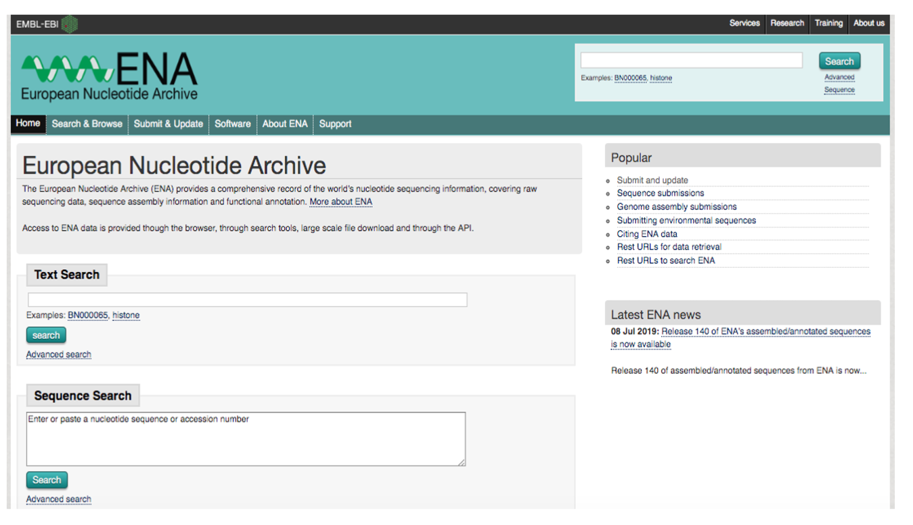
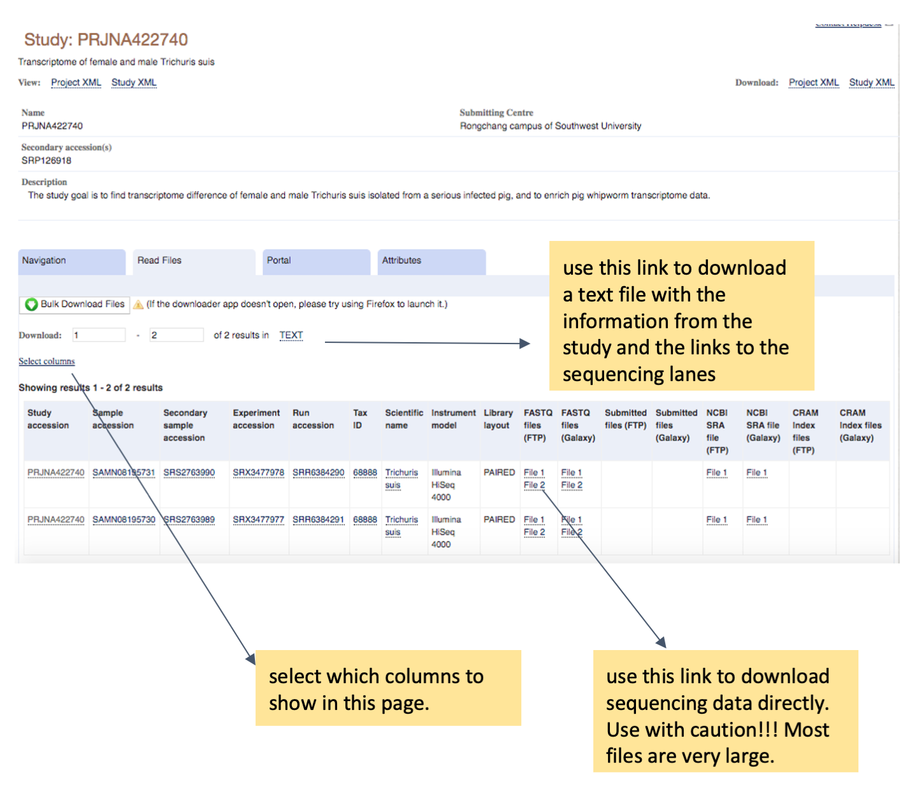

# Finding data on the web.

There is a lot of data already available on public repositories. These are fantastic resources to the scientific community and it is worth learning where to find it, how to search for it and how to download the data. 

In this section you will learn about two resources from the European Bioinformatics Institute, or EBI for short. These are the ENA (the European Nucleotide Archive) search page and ArrayExpress, a bespoke gene expression database. We will focus in obtaining data from genome sequencing and transcriptome sequencing.

## ENA - European Nucleotide Archive

This is a very general database, equivalent to the NCBI main database search which you were introduced early in this course. Whether to use NCBI/SRA or EBI/ENA for obtaining sequencing data is a matter of personal interest. 

In the search boxes, one can enter any term. For example, try entering “Trichuris” and see what the results bring. 

https://www.ebi.ac.uk/ena


On the left hand side, you will be given a summary of the data types that were found under the search term. If you are after sequencing data, “Read - experiment” is a good place to start. You can also try “Study” or “Submission”


Under “Study/study” you will find the following list. Note that this list will change over time as new studies are submitted. Here you can see some genome sequences as well as transcriptome sequences that were submitted to the repository. 


---



## Downloading data using ‘wget’.

The TEXT file that contains all the selected fields from the study. If you have selected the “FASTQ files (FTP)” option, the text file will include the ftp address from where the files can be downloaded directly. This is the equivalent of clicking on the link but it is possible to script these downloads so they can proceed without much supervision. 

To that end, we can use the command ‘wget’ that comes included in most linux distributions (or you can download it). One of the fields in the TEXT file from the study will contain an FTP address like:

`ftp.sra.ebi.ac.uk/vol1/fastq/SRR638/001/SRR6384291/SRR6384291_2.fastq.gz`

We can use the wget command to automatically download the fastq.

```bash
wget ftp.sra.ebi.ac.uk/vol1/fastq/SRR638/001/SRR6384291/SRR6384291_2.fastq.gz
```

With a bit of scripting and text manipulation, it is possible to have a list of ‘wget’ commands to download the whole data set.

(You can try this set of commands on the downloaded project file (PRXXXXX.txt))

```bash
awk '{print $13}' PRJNA422740.txt | grep ^ftp | tr ";" "\n" | awk '{print "wget "$1}' 

wget ftp.sra.ebi.ac.uk/vol1/fastq/SRR638/000/SRR6384290/SRR6384290_1.fastq.gz
wget ftp.sra.ebi.ac.uk/vol1/fastq/SRR638/000/SRR6384290/SRR6384290_2.fastq.gz
wget ftp.sra.ebi.ac.uk/vol1/fastq/SRR638/001/SRR6384291/SRR6384291_1.fastq.gz
wget ftp.sra.ebi.ac.uk/vol1/fastq/SRR638/001/SRR6384291/SRR6384291_2.fastq.gz
```

**The command explained:**

`awk ‘{print $13}’` 		  selects only the 13th column in the file
`grep ^ftp`			          selects only those lines that start (^) with ‘ftp’
`tr ";" "\n"` 			      translates the character “;” into a new line “\n”
`awk '{print "wget "$1}'`	prints the word “wget “ followed by the first column of the input

You can save these commands to a file

```bash
awk '{print $13}' PRJNA422740.txt | grep ^ftp | tr ";" "\n" | awk '{print "wget "$1}' > download_lanes.sh 

cat download_lanes.sh
```

You should see the **on-screen output** similar to one below

```
wget ftp.sra.ebi.ac.uk/vol1/fastq/SRR638/000/SRR6384290/SRR6384290_1.fastq.gz
wget ftp.sra.ebi.ac.uk/vol1/fastq/SRR638/000/SRR6384290/SRR6384290_2.fastq.gz
wget ftp.sra.ebi.ac.uk/vol1/fastq/SRR638/001/SRR6384291/SRR6384291_1.fastq.gz
wget ftp.sra.ebi.ac.uk/vol1/fastq/SRR638/001/SRR6384291/SRR6384291_2.fastq.gz
```

The execute the file and start downloading data:

```bash
bash download_lanes.sh 
```

The **on-screen output** may look similar to the one below
```
--2019-07-30 15:09:32--  http://ftp.sra.ebi.ac.uk/vol1/fastq/SRR638/000/SRR6384290/SRR6384290_1.fastq.gz
Resolving ftp.sra.ebi.ac.uk... 193.62.192.7
Connecting to ftp.sra.ebi.ac.uk|193.62.192.7|:80... connected.
HTTP request sent, awaiting response... 200 OK
Length: 2214434733 (2.1G) [application/octet-stream]
Saving to: ‘SRR6384290_1.fastq.gz’

SRR6384290_1.fastq.gz       0%[            ]   5.33M   264KB/s    eta 2h 43m 
```
**Note:** certain downloads can take minutes while others can take  hours depending on the file size and your internet connection


