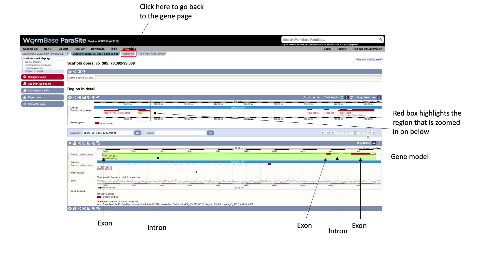
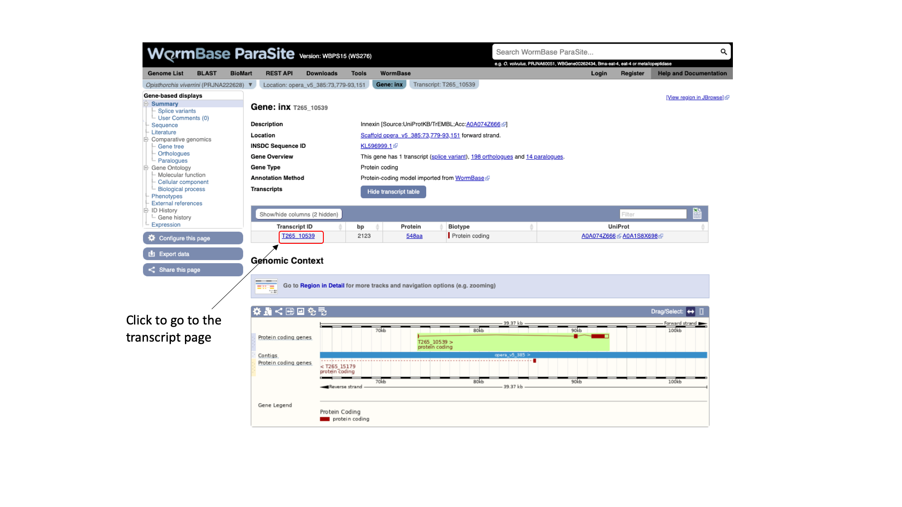
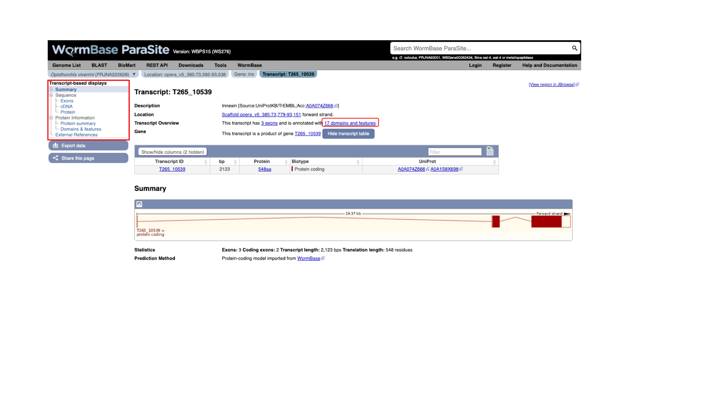
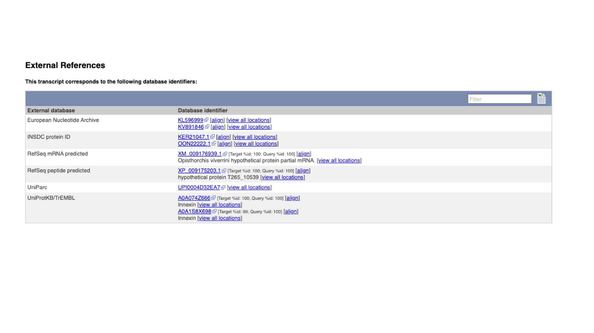
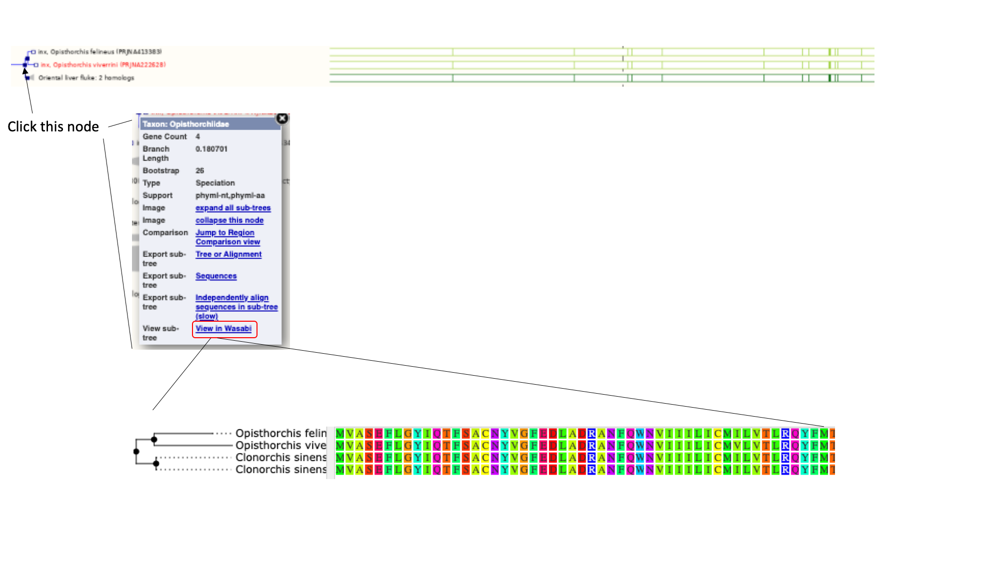
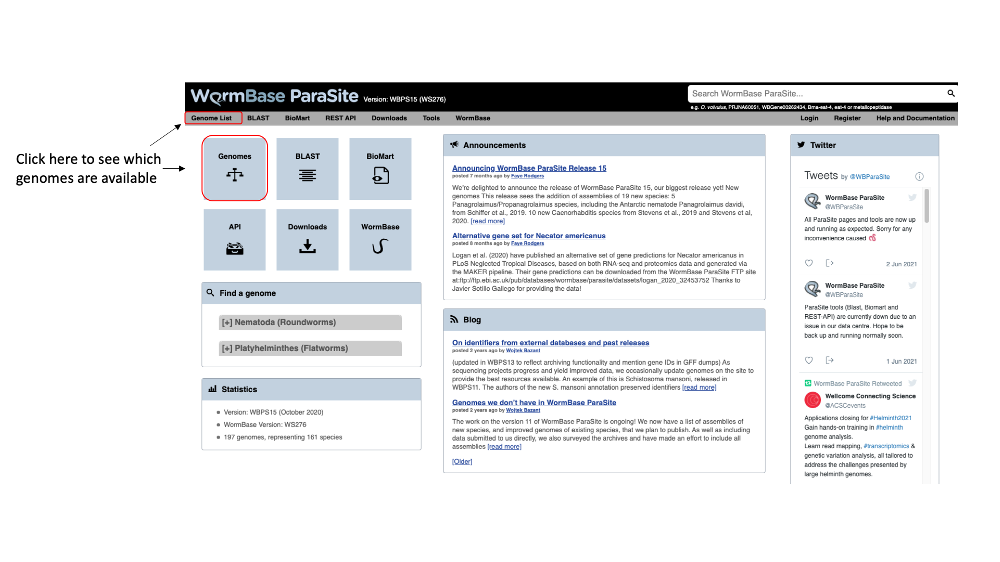
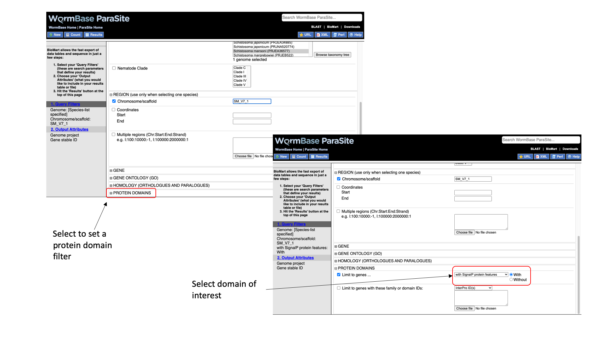

# WormBase ParaSite

## Table of contents
1. [Overview and Aims](#intro)
2. [Genes and genomes](#genes_and_genomes)
3. [Looking at genes in WormBase ParaSite](#wbps_genes)
    * [The gene page](#gene_page)
    * [Functional annotation: protein domains and GO terms](#functional_annotation)
    * [Orthologues and paralogues](#comparative_genomics)
    * [EXERCISE](#gene_page_exercise)
4. [Looking at genomes in WormBase ParaSite](#wbps_genomes)
    * [EXERCISE](#genomes_exercise)
6. [BioMart](#biomart)

## Overview and Aims <a name="intro"></a>
WormBase ParaSite is a specialist website that presents data on helminth genomics, gathering together nematode and flatworm genomes that have been assembled and annotated by the research community. Many of the analyses that you did in module 1 can be found pre-computed on WormBase ParaSite, making the data easily accessible in one website. In this module, we’ll demonstrate the different ways that you can interact with WormBase ParaSite data and tools.
We will start by exploring the basic function of the website (part A); go on to examine two ways in which the WormBase ParaSite data can be queried for bulk access (part B); and end by exploring two popular tools in WormBase ParaSite: JBrowse and the Variant Effect Predictor (part C)

## Genes and Genomes  <a name="genes_and_genomes"></a>

## Looking at genes in WormBase ParaSite <a name="wbps_genes"></a>
In this first part of the module we will explore the basic functionality of the WormBase ParaSite website for looking at helminth genes and genomes.

### The Gene Page <a name="gene_page"></a>
The aim of this section is to familiarise you with retrieving information about a gene of interest from WormBase ParaSite. We will use a walk through example to illustrate how to use the website to find out about the function of an Opisthorcis viverrini gene.

#### Basic Navigation
* Open up a web browser, and type this URL into the address bar: https://parasite.wormbase.org/

The page should look something like this:

  

* Paste "T265_10539" into the search bar in the top right of the page and click return. T265_10539 is a gene stable ID.

  

You should get one result returned. Let's look at the T265_10539 gene page.

Every gene in WormBase ParaSite has a gene page, which presents sequence data and a summary of information from various sources about the gene.


The gene page has three main sections. In the summary section, together with the description of our gene we can also see the genomic location of the gene (chromosome 1, in this case) and the INSDC Sequence ID. This is an identifier that links to an entry for the scaffold in the International Nucleotide Sequence Database Collaboration resources (the European Nucleotide Archive, GenBank, and the DNA Databank of Japan). Underneath, we can see some information about the gene: it has 1 transcript isoform and a number of orthologues and paralogues. We’ll revisit this later. We can also see that the gene is protein-coding.

#### Transcript isoforms
```
As covered in module 1, according to the central dogma of molecular biology, eukaryotic genes (DNA) are transcribed to primary transcripts (RNA), which are spliced and capped to form mature transcripts (mRNA) then translated to proteins (polypeptide chains of amino acids). In the 1970s, it was discovered that a single gene can give rise to more than one protein, due to the processes of alternative splicing and alternative translation. When there is evidence for a single gene giving rise to multiple different transcripts in this way, we call the transcripts “isoforms”. The S. ratti example that we have been looking at has 2 transcript isoforms. Here is another example (in C. elegans):

Here, the gene produces two alternative transcripts: one that contains four exons, and one that has skipped the third exon, to produce a shorter mature mRNA. Alternative splicing is a tightly regulated process: different transcripts of a gene might be produced in different tissues, or at different stages of a parasite’s life cycle. It is a process that is common to eukaryotes, allowing organisms to introduce diversity to the complement of proteins that they encode.

```
On the left, we have a navigation menu, which can be used to explore the information that is available for each gene. We’ll be going through each of these menu options in turn.

The “Genomic context” image underneath shows us a snapshot of the scaffold that our gene is on.

* Click the ‘Region in Detail’ link in the “Genomic context” section.


Here, each of the three boxes gives us an increasingly zoomed-in view of the gene’s genomic position. The top box shows us that the gene is located approximately a quarter of the way along the scaffold ("opera_v5_385"). The middle box shows us the local surrounding region of the scaffold. The bottom box shows us the structure of the gene model.

We can see that:

(a) the gene is on the forward strand - you can see this from the ‘>’ symbol located next to the gene name in the protein coding genes track.

(b) the gene has three exons in total, of which 2 contain coding sequence. Both 5' and 3' UTRs (untranslated regions) are annotated.

* Navigate back to the gene page by clicking the "Gene:inx" tab at the top of the page.

As well as gene pages, WormBase ParaSite has a page for each transcript that a gene produces. We have to navigate to the transcript page to see which protein domains have been annotated. 

* On the gene page, click the transcript ID in the transcipt table to navigate to the transcript page.



Again using the navigation menu on the left hand side of the page, we can retrieve three main types of information on the transcript: sequences, information about the protein domains, and external references.



* Click “Exons”, “cDNA” and “Protein” in the “Sequence” section of the navigation menu to see the different types of sequence that are available for the transcript.


The “Exons” tab displays the sequence of individual exons in a table (useful if you’re interested in retrieving, say, only the sequence of exon 2), the “cDNA” tab has the cDNA sequence (the sequence you would get if you reverse transcribed mature mRNA), and the “Protein” tab has the amino acid sequence.
All of the sequences can be downloaded in FASTA format - this is a text format that is widely used for representing sequences, which was introduced in module 1. It consists of a header line (a “>” character and a description or name of the sequence) followed by the sequence itself on the next line. As well as the sequences displayed in the browser, you can also choose to download, for example, genomic sequence, just UTRs etc.


#### Functional annotation: protein domains and GO terms <a name="functional_annotation"></a>

Section on interproscan.

* Click the “Protein summary” menu option in the navigation menu.


On this page we see a pictorial representation of the protein domains that have been annotated to this polypeptide. For every protein in WormBase ParaSite, we have pre-run InterProScan. We can see here that this protein has a match with an Innexin domain in several protein domain databases, and four transmembrane helices.


The same data is available in tabular format

* Click the “Domains & features” menu option.


Where possible, annotated domains are linked to their entries in the appropriate external database. As you saw in module 1, these often have useful descriptions of what is known about the domain. A good place to start to learn about protein domains is usually the InterPro website: follow the IPR000990 link in the InterPro column to learn more about the biology of protein.

* Click “External References” in the navigation menu.



External references are the identifiers by which the gene (or transcript or protein, in this case) is known in other databases. These usually include RefSeq (the reference sequence database of the NCBI) and UniProt, and sometimes (though not in this case), WormBase ParaSite’s sister database, WormBase.

Another fast way to find out about the function of a gene’s product is to see which Gene Ontology (GO) terms have been associated with it. GO is a project that seeks to describe complex biology in a logical, hierarchical and computer-processable way. It is a controlled vocabulary, whereby proteins are associated with GO terms that describe their function. There are three aspects to GO: Cellular Component, Molecular Function and Biological Process. Cellular Component GO terms describe where a protein is localised (in the membrane, extracellular, in the nucleus etc). Molecular Function GO terms describe the biochemical activity of the protein. Biological Process GO terms describe the pathways and broader processes that the protein contributes to.

* Click the “Gene:inx” tab at the top of the page to return to the main gene page, then select “Cellular component” from the Gene Ontology section of the navigation menu.


WormBase ParaSite imports GO annotations from three sources: terms assigned by UniProt, terms inferred by the protein’s InterPro domains, and terms that have been associated with orthologues of the gene of interest. 

#### Comparative genomics <a name="comparative_genomics"></a>

Another approach to understanding what a gene does is comparative genomics. WormBase ParaSite runs a comparative genomics pipeline, called Compara, that seeks to group all helminth genes, together with comparator genes from a number of model organisms, into families. You can explore the results of the Compara pipeline in a few different ways.

* Select “Gene tree” from the Comparative Genomics section of the navigation menu.


The gene tree shows the inferred evolutionary history of the family that this gene is a member of. At the ends of the branches are genes, with our gene of interest highlighted in red. The points where the branches split are called nodes; nodes represent different evolutionary events, with these being represented in the tree by different colours. Dark blue nodes represent speciation events (where two populations of an existing species diverged into two new species). Red nodes represent duplications, where within the genome of one species the gene was duplicated. Turquoise nodes are ambiguous.

Note that the most closely related genes in the tree are from other Strongyloides species: the animal parasites S. venezuelensis and S. papillosus and the human parasite S. stercoralis. These genes are all orthologues of our gene of interest. Orthologues are genes that evolved from a common ancestral gene by speciation; they may have diverged to a greater or lesser degree in their sequences, but often retain their function in their respective species. Similarly, paralogues are genes that have evolved from a common ancestral gene by duplication (see the information box on the Compara pipeline). They are genes that are found in more than one copy in a species’ genome.

It can be useful to look at alignments of these related proteins to see how well conserved they are. Highly conserved regions are more likely to be essential for the function of the protein.

* Click on the section of the tree labelled “Blood flukes and click “expand this subtree”.

Next to the main tree, in green, we can see a pictorial summary of the multiple alignment of the proteins of these four genes, with green coloured regions representing alignments and non-coloured regions representing gaps. You may be interested in exploring these alignments at a higher resolution.

* Click the node that separates the Opisthorchis from the oriental liver fluke, then click "View in Wasabi" in the pop up box.

A multiple alignment of the four proteins will appear in a new window: we can see that these protein sequences are extremely well conserved. 



Orthologues and paralogues are also available in tabular format, where they can be easily exported.

* Select “Orthologues” in the navigation menu.


In the main table on this page, each row represents an orthologue of *inx*. The table gives details on the nature of the relationship between our *O. viverrini* gene and the gene in the other species, such as whether the gene has one or multiple orthologues in the other species (1-to-1 or 1-to-many), and how similar the two proteins are. Multiple alignments can be viewed by following the links.

#### Compara: further details

Compara is a pipeline, developed by the Ensembl project, which groups related genes into families and defines the evolutionary relationships between them. Below is a summary of the steps of the pipeline:
1. A library of protein family Hidden Markov Models (HMMs) is used as a starting point. Gene sequences are scored against these models, giving a probability of how likely each sequence is to be a member of the corresponding family. The HMM library used in the Compara pipeline is based on the Panther and TreeFam databases.
2. Any proteins that were not classified into a family in the HMM search are then compared with each other by all-against-all BLAST.
3. Any family with more than 400 members is broken down into smaller families (max 400 proteins).
4. All of the protein sequences in each family are aligned against each other using efficient multiple alignment software.
5. For each family, a phylogenetic tree is built (using TreeBeST5). Tree building is guided by a species phylogenetic tree.
6. Orthologues and paralogues are called on the basis of the resulting tree: any two genes separated by speciation events are orthologs, and any two genes in the same species separated by a duplication event are paralogues.

#### Gene page exercise <a name="gene_page_exercise"></a>

The aim of this exercise is to familiarise yourself with the WormBase ParaSite gene page.
Go to the gene page for the Trichuris muris gene TMUE_2000008757 and retrieve the following information:
1. What is the summary description of the gene? Do you have any idea what the gene might be doing from this description?
2. How many transcripts of the gene are annotated?
3. Which strand is the gene on? What is the name of the 5’ neighbouring gene?
4. Download the 3’UTR sequence.
5. What identifier would you use to search for the gene in Uniprot?
6. Where is this gene’s protein predicted to localise to?
7. Which Pfam domains is the protein predicted to have? Which of these is responsible for its DNA binding activity?
8. Download the protein alignment of TMUE_2000008757 and its C elegans orthologue. Is there any published literature on the C elegans orthologue? (Hint: follow the link to the WormBase ParaSite page for the C elegans orthologue and look in the “Literature” tab).


## Looking at genomes in WormBase ParaSite <a name="wbps_genomes"></a>

In this section, we’ll explore how genome assemblies are presented in WormBase ParaSite, and look at some commonly used metrics of assembly quality.

* From the WormBase ParaSite homepage, click either the ”Genome List” tab in the tools bar, or the “Genomes” icon.



This will take you to a list of all of the genomes currently available in WormBase ParaSite, divided phylogenetically into the nematoda and the platyhelminthes. You might notice that some species (like Ancylostoma ceylanicum in the figure below) have two entries: this is because the research community has produced two different assemblies for these genomes, and WormBase ParaSite makes them both available. In this table you can also find a link to the sequence archive where the genome sequence was originally deposited (‘BioProject ID’) and a link to two different genomes browsers, JBrowse and Ensembl. We’ll cover the use of genome browsers to visualise genomes later. The ‘CEGMA’, ‘BUSCO’ and ‘N50’ columns give some statistics about the quality of the genome assembly. We will cover exactly what these values mean below.


* Scroll down the page to find Brugia malayi and click the species name link- this will take you to the B. malayi genome page.


The genome page has useful summary information about the species and the assembly. You can see a summary of the methods used to produce the assembly and the annotation, and links to the publication describing it in more detail (where this is available).

* Look now at the ‘Assembly statistics’ box.


The information in this box tells us about two metrics related to the quality of the assembly: contiguity and completeness. Contiguity describes how many scaffolds a genome is represented by: in a perfectly contiguous reference genome, the number of scaffolds would be equal to the number of chromosomes. Contiguity is described by several values, including the total number of scaffolds in the assembly, the length of the longest scaffold, the N50 length and the N90 length. If all of the scaffolds of the assembly were lined up in order of longest to shortest, the N50 length is the length of the scaffold at the midpoint. Similarly, the N90 length is the length of the scaffold at the 90th percentile. For a given genome, a larger N50 length and N90 length generally indicate a more contiguous assembly.

In the “Assembly statistics” widget, the circumference of the circle represents the whole genome assembly, with scaffolds ordered from longest to shortest. The diameter of the grey colour represents the length of the scaffold represented at each point of the circle. The light grey shading represents the N90 scaffold, whilst the dark grey shading represents the N50 scaffold. The light blue outer ring shows the GC/AT/N percentage of the scaffold.
Mouse over the widget to explore the number of scaffolds contributing to the genome. You should see that the N50 length (14.2 Mb) is the third longest scaffold, and the N90 length (13.5 Mb) is the fifth longest scaffold.

CEGMA and BUSCO are two (similar) methods of assessing genome completeness. They are based on the principle that some genes are so highly conserved across eukaryotic species that they should be present in any genome assembly, in single copy. Generally speaking, a higher percentage of complete CEGMA genes, or single BUSCO genes, indicates a higher quality assembly. A word of warning though: CEGMA and BUSCO are known to underperform for certain taxonomic groups. Although the genes are selected because they are supposed to be universally conserved, this is not always the case. Platyhelminth genomes tend to have lower CEGMA and BUSCO scores; this is not necessarily because the genomes are lower quality, but because some highly conserved eukaryotic genes are truly absent from this group of organisms.

#### Genome assembly metrics exercise <a name="genomes_exercise"></a>

There are two other Brugia sp. genome assemblies in WormBase ParaSite, which are of much lower quality than Brugia malayi. According to their scaffold statistics and CEGMA/BUSCO scores, which of these two assemblies is more contiguous and complete?

## BioMart <a name="biomart"></a>

BioMart is an extremely powerful tool that allows you to query WormBase ParaSite data in bulk, with no programming knowledge. Consider the information that we gathered on our gene of interest in part A, by clicking around the gene page. Now imagine that rather than having one gene of interest, we actually have a list of 100 genes. That would be a lot of clicking around on gene pages! BioMart allows you to output all of this data for multiple genes in a few clicks.

Retrieving data for a list of known genes isn’t the only thing that BioMart can do. In this section, we’ll go through a series of examples that aim to illustrate the power of this tool. First, a little bit about how to construct queries. Queries are constructed with three facets: filters, values and attributes. Filters specify the type of data that you’re specifying your query on. Values are the actual values of that data type: for example, if your filter were ‘gene IDs’, your values would be a list of actual gene IDs. Attributes are the data types that you want to retrieve. For example, you might want to retrieve the genomic coordinates of your gene IDs. The table below lists some examples of filters and attributes for BioMart queries.

| Filters       | Attributes           | 
| ------------- |-------------| 
| A genome      | Gene, transcript or protein IDs | 
| A genomic region | Sequences      |
| A list of gene IDs| Identifiers from external databases (eg, Uniprot IDs)      |
| All genes that have GO term x, or protein domain Y| Protein domains or GO terms associated with a gene ID    |
| All genes that have GO term x, or protein domain Y| IDs of orthologous genes, % identity   | 

Filters and attributes can be combined to produce more complex queries and customised output; for example: you might want to retrieve the IDs and predicted protein domains of all of the genes from Schistosoma mansoni chromosome 1 that have a predicted signal peptide. We’ll walk through this example to get started.

* From the WormBase ParaSite homepage, select BioMart from the tool bar, or the BioMart icon.


We have to set three query filters: the genome (the S. mansoni genome), genomic location (chromosome 1), and a protein domain (genes whose protein product have a predicted signal peptide).

* Select “Species”, tick the “genome” checkbox and scroll down to select “Schistosoma mansoni (PRJEA36577)”.


* Select “Region”, tick the “Chromosome/scaffold” check box and type “Sm_V7_1” into the text field (you must know the exact name of the chromosome).


* Select “Protein domains”, tick the “Limit to genes...” checkbox and select “with SignalP protein features”



Note that as we have built up the query, the filters have appeared on the left hand side of the page.

* Click “count” to count the number of genes in the database that fulfil these filter criteria.


Next we will select the output attributes. “Genome project” and “Gene stable ID” are already pre-selected as attributes.

* Select “Output attributes”


BioMart lets us generate two types of output: data tables, and sequence (FASTA) files. In this example we’ll be generating a data table. We want to retrieve the gene IDs and associated protein domains of the 215 genes that fulfil our filter criteria.

* Select “Interpro protein domains” and check the tick boxes for “InterPro ID”, “InterPro short description”, “Start position” and “End position”.


* Click “Results” to see a preview your results table. The full results table can be downloaded by selecting the file type you’d like to download and clicking “Go”.


#### BioMart exercise <a name="biomart_exercise"></a>

In the data directory for module 1, you will find two files containing lists of gene IDs: Sratti_genes.txt, and Smansoni_genes.txt. Use the gene IDs in Sratti_genes.txt to retrieve the following data:
1. Their WormBase gene IDs and UniProtKB/TrEMBL IDs.
2. The InterPro domains that they have been annotated with (InterPro short description). [Q: why do some of the output rows appear multiple times?]
3. The gene stable IDs of their Strongyloides stercoralis orthologues. [Q: which gene has more than one S. stercoralis orthologue?].
4. The names of any GO terms associated with the genes. 
5. A FASTA file of their peptide sequences.
Use the gene IDs in Smansoni_genes.txt to answer the following questions:
6. How many of these genes have orthologues in both S. haematobium and S. japonicum? Generate a table that has the gene stable ID for the homologue in all three species, the homology type (1-1, 1-many, etc), and, for the S. haematobium and S. japonicum orthologues, the % identity of the gene to its S. mansoni orthologue.
Of these genes, how many also (a) do not have a human or mouse orthologue and (b) have a signal peptide?
7. Retrieve (a) a FASTA file with the CDS sequence of each transcript encoded by these genes. Make sure that the transcript stable ID is in the header. (b) a FASTA file containing the CDS sequence plus 100 nt downstream of the stop codon of each of those transcripts. In the header, include the transcript stable ID and the name of the scaffold that the transcript is on.
8. Generate a table containing all of the protein coding genes on Brugia malayi scaffold Bm_007. The table should have their gene stable IDs and start and end coordinates. For genes that have paralogue(s), include the stable ID, coordinates and scaffold of the paralogue(s).
For these genes, generate a table that maps each gene stable ID to its UniProt ID.
9. Retrieve a list of Onchocerca volvulus genes that are annotated with the GO term “reproduction” (or any of its child terms). In the output, include the IDs and short descriptions of the InterPro protein domains associated with the genes.
10. How many worm pseudogenes are annotated in WBPS? Which worm genomes have annotated pseudogenes?


