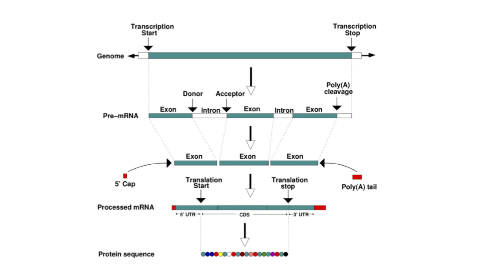
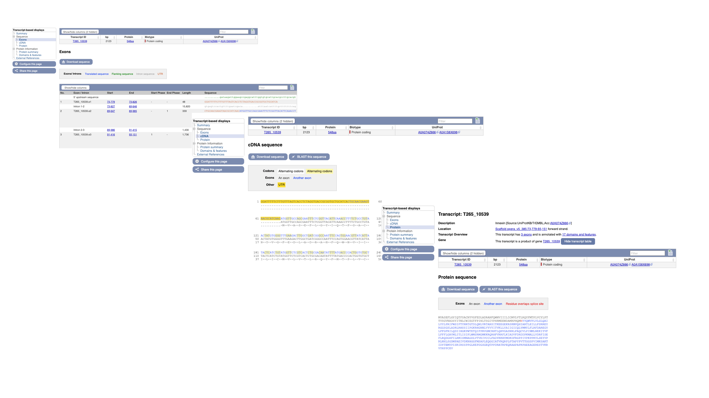
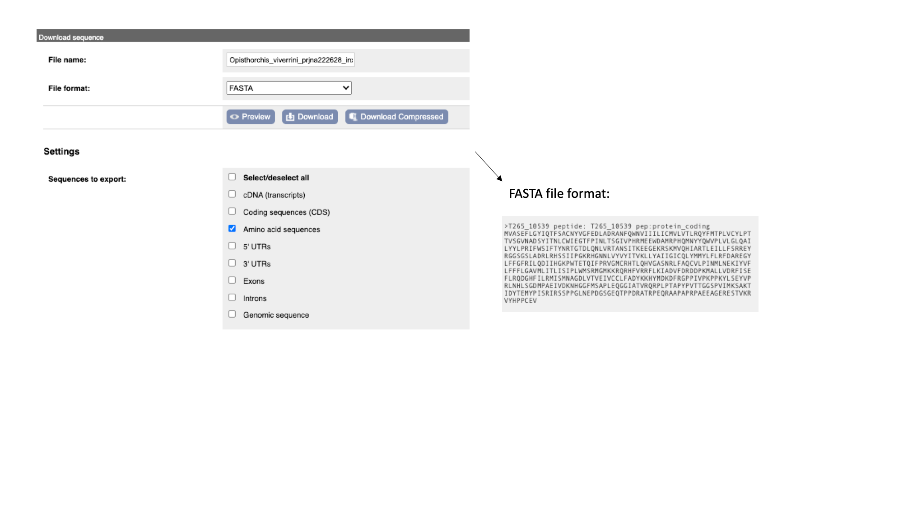
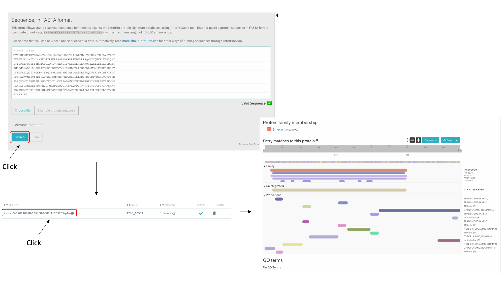
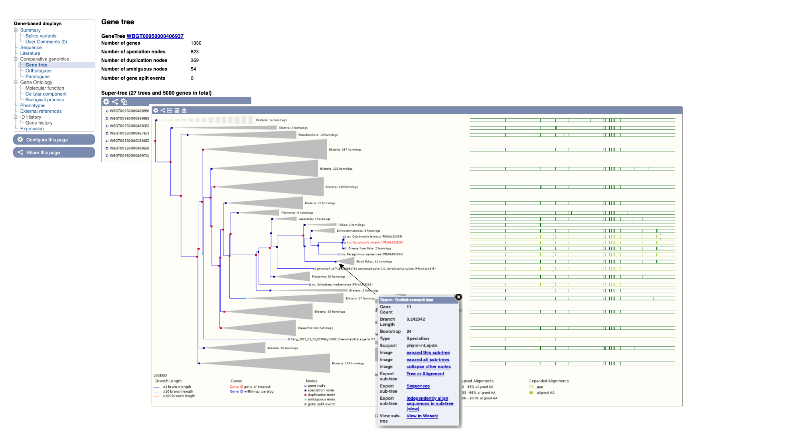
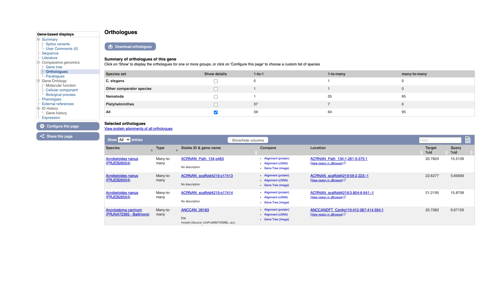
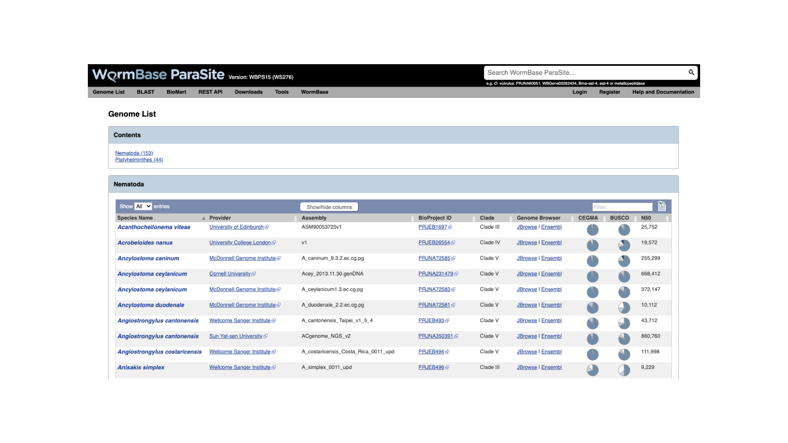
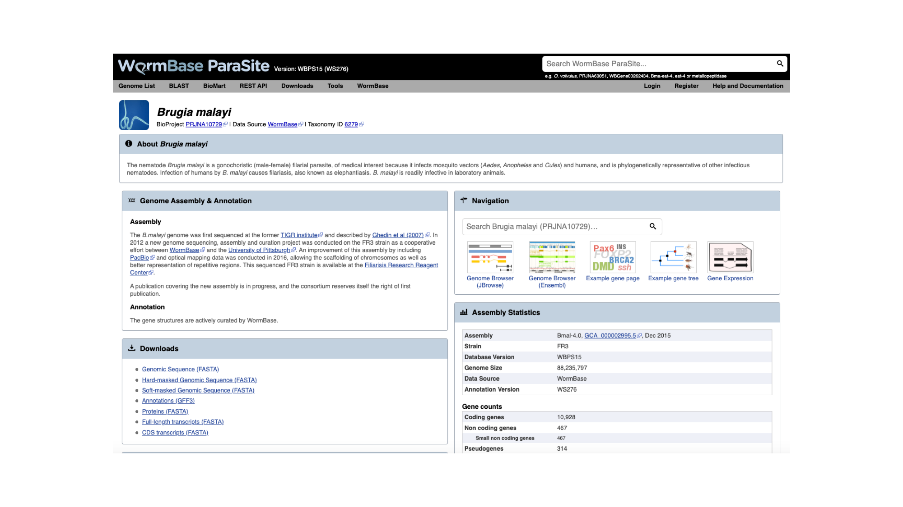
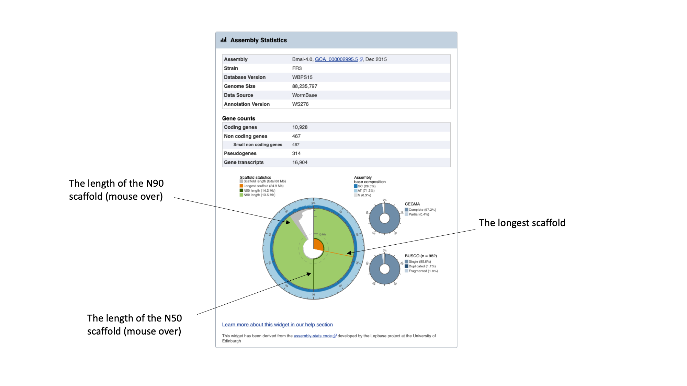

# WormBase ParaSite

## Table of contents
1. [Overview and Aims](#intro)
2. [Genes and genomes](#genes_and_genomes)
    * [Genes: the basics](#basics_genes)
    * [Genomes: the basics](#basics_genomes)
    * [Sequence databases](#sequence_databases)
3. [Looking at genes in WormBase ParaSite](#wbps_genes)
    * [The gene page](#gene_page)
    * [Functional annotation: protein domains and GO terms](#functional_annotation)
    * [Orthologues and paralogues](#comparative_genomics)
    * [EXERCISE](#gene_page_exercise)
4. [Looking at genomes in WormBase ParaSite](#wbps_genomes)
    * [EXERCISE](#genomes_exercise)
5. [BioMart](#biomart)
    * [EXERCISE](#biomart_exercise)

## Overview and Aims 
In this first module we'll start by reviewing the basics on genes and genomes: what they are, how we represent and talk about them, and how we go from a DNA sequence- a string of letters- to making predictions about gene function. We'll look at this in the context of WormBase ParaSite (which you might also see referred to as WBPS) and other online database resources. 

In short, WormBase ParaSite gathers together nematode and flatworm genomes that have been assembled and annotated by the research community, adds additional analyses and makes these data available to the scientific community. We'll look at the kind of data you can retrieve, initially by exploring the website. In the last part of the module we'll introduce BioMart. This is a data-mining tool that allows you to retrieve WormBase ParaSite data in bulk.

## Genes and Genomes  

Throughout this course, we assume that you're familiar with genes and genomes. 

### Genes: the basics  

A **gene** is a unit of the genome, a DNA sequence, that is transcribed into an RNA molecule, or a transcript. A gene's transcript may go on to be translated into a protein (in that case it is an mRNA), or it may have a role as a non-coding RNA. Examples of the latter include ribosomal RNAs (rRNA), transfer RNAs (tRNA) and microRNAs (miRNA).

In eukaryotes, most protein-coding genes comprise alternating **exons** and **introns** (some genes have a single exon), flanked by **untranslated regions** (UTRs). The exons constitute the parts of the gene that are translated into a polypeptide. Introns are transcribed but soon after excised and the final mature mRNA is formed by a 5’UTR, joined exons and a 3’UTR. A CAP and poly-A tail are added to the 5’ and 3’ ends respectively. These structures are essential to guarantee the molecular stability and downstream processing of the mRNAs.

This figure represents the steps that are needed to transform information encoded in the DNA into a polypeptide and eventually a functional protein. The starting information is encoded in the genome. A gene encodes, among other things, the transcription start and transcription end. These are the nucleotides from where an RNA copy of the DNA will be generated. This copy is the pre-mRNA which is formed by exons and introns. Maturation of the mRNA molecule happens as it is transcribed and involves the splicing (removal) of introns with the concomitant joining of exons, addition of a CAP at the 5’ end and a polyadenylation tail (many As - AAAAAAA) at the 3’end. A processed mRNA will be the template for the translation of the mRNA message into a protein by the ribosome.

### Genomes: the basics  

A **genome** is an organism’s complete set of genetic material. Although every individual's genome is unique, the genomes of individuals of the same species will be very similar. It is useful to have a representative genome sequence for each species, and this is referred to as a reference genome. 

In the cell, genomes are organised into chromosomes. In practice, current DNA sequencing methods are unable to read the DNA sequence of a whole chromosome without errors. We therefore use the technique of sequencing shorter segments of chromosomes, and do it in such a way that the segments overlap and can be pieced together like a jigsaw puzzle. This process is referred to as genome assembly. For now, we will focus on what genome assemblies look like, and how they are represented in genome databases. 

The diagram below shows the structure of a typical assembly. It has 3 layers: the contigs are stretches of contiguous DNA sequence without gaps. The scaffolds are ordered sets of contigs separated by gaps of estimated length. In order to make scaffolds from contigs, techniques such as optical mapping and Hi-C are used. Finally, the chromosome is an ordered set of scaffolds separated by gaps on unknown length. To make the chromosome sequence from the scaffold, techniques such linkage mapping and FISH are used.

Sometimes, there is insufficient (or no) data to reliably place a scaffold into a specific position on a chromosome. In the figure above, this is true of the scaffold on the right. The assembly above therefore comprises 2 toplevel sequences: 1 chromosome, and one unplaced scaffold.

### Sequence databases 

Over the last few decades, as technology has evolved, we've seen an explosion in the number of genes and, later, genomes that have been sequenced. Sequence databases provide a place where these sequences can be deposited, stored and made available to the world. There are three widely-used nucleotide repositories (or primary databases) for the submission of nucleotide and genome sequences:

* [GenBank](https://www.ncbi.nlm.nih.gov/genbank), hosted by the National Center for Biotechnology Information (or NCBI).
* The [European Nucleotide Archive (ENA)](http://www.ebi.ac.uk/ena), hosted by the European Molecular Biology Laboratories (EMBL).
* The [DNA Data Bank of Japan (DDBJ)](http://www.ddbj.nig.ac.jp),  hosted by the National Centre for Genetics.

Together they form the [International Nucleotide Sequence Database Collaboration](http://www.insdc.org/about) and luckily for users, they all “mirror” each other. This means that irrespective of where a sequence is submitted, the entry will appear in all three databases. Once data are deposited in primary databases, they can be accessed freely by anyone around the world.

INSDC stores both primary data (i.e. the sequence reads exactly as they come off the machine) and assembled genomes (i.e. where an assembly algorithm has been used to build scaffolds or chromosomes from those reads). Commonly, these data are all stored together under what's known as a **BioProject**. Each BioProject is identified by an **accession**. Although every BioProject accession is a unique identifier for that project, they all start with a 5-letter code that denotes which INSDC database the data were submitted to: "PRJEB" for ENA, "PRJNA" for GenBank, and "PRJDB" for DDBJ. 

An AGP file is often also provided, describing how the contigs fit together as scaffolds, and how the scaffolds fit together as chromosomes. A genome project may also contain an annotation file in GFF format (more on this file format later). This file contains predicted gene structures: based on the genome sequence, certain algorithms can predict which regions encode genes. An example of a commonly-used gene prediction tools is [BRAKER](https://github.com/Gaius-Augustus/BRAKER). These predictions may or may not be guided by other types of evidence, such as RNA sequencing data. It is important to bear in mind that the majority of genes as they appear in the sequence databases (and also in WormBase ParaSite) are based on predictions: these predictions are driven by evidence, but most genes from helminth genome assemblies are unlikely to have been cloned and sequenced in their entirety. We'll look at an example of checking how well a gene model is supported by RNAseq evidence in the next WormBase ParaSite module.

[↥ **Back to top**](#top)

## Looking at genes in WormBase ParaSite 
WormBase ParaSite takes sequence data from INSDC (a genome assembly and a set of gene predictions) and adds additional analyses that assist scientists in interpreting and querying this data. In this part of the module we will explore the basic functionality of the website for looking at helminth genes and genomes. 

### The Gene Page 
The aim of this section is to familiarise you with retrieving information about a gene of interest from WormBase ParaSite. We will use a walk through example to illustrate how to use the website to find out about the function of an _Opisthorcis viverrini_ gene.

#### Basic Navigation
* Open up a web browser, and type this URL into the address bar: https://parasite.wormbase.org/

The page should look something like this:

  

* Paste "T265_10539" into the search bar in the top right of the page and click return. T265_10539 is a gene stable ID. These identifiers are allocated by the scientist or group that sequenced and annotated the genome.

  

You should get one result, matching a gene in *Opisthorchis viverrini*, the Southeast Asian Liver Fluke. Let's look at the page for the T265_10539 gene:

* Click T265_10539

Every gene in WormBase ParaSite has a gene page, which presents sequence data and a summary of information from various sources about the gene.

The gene page has three main sections. In the summary section, together with the description of our gene we can also see the genomic location of the gene ("opera_v5_385", in this case) and the INSDC Sequence ID. This is an identifier that links to an entry for the scaffold in ENA.

* Click the "INSDC Sequence ID" link to look at the scaffold's entry in ENA. Can you identify the accession of the BioProject (or "Study") that this genome assembly belongs to?

Navigate back to the T265_10539 gene page on WormBase ParaSite. Underneath, we can see some information about the gene: it has one transcript isoform and a number of orthologues and paralogues. We’ll revisit this later. We can also see that the gene is protein-coding.

On the left, we have a navigation menu, which can be used to explore the information that is available for each gene. We’ll be going through each of these menu options in turn.

The “Genomic context” image underneath shows us a snapshot of the scaffold that our gene is on.

* Click the ‘Region in Detail’ link in the “Genomic context” section.

Here, each of the three boxes gives us an increasingly zoomed-in view of the gene’s genomic position. The top box shows us that the gene is located approximately a quarter of the way along the scaffold ("opera_v5_385"). The middle box shows us the local surrounding region of the scaffold. The bottom box shows us the structure of the gene model.

We can see that:

(a) the gene is on the forward strand - you can see this from the ‘>’ symbol located next to the gene name in the protein coding genes track.

(b) the gene has three exons in total, of which 2 contain coding sequence. Both 5' and 3' UTRs (untranslated regions) are annotated.

* Navigate back to the gene page by clicking the "Gene:inx" tab at the top of the page.

As well as gene pages, WormBase ParaSite has a page for each transcript that a gene produces. In this case, only one transcript isoform has been annotated.

* On the gene page, click the transcript ID in the transcipt table to navigate to the transcript page.

Again using the navigation menu on the left hand side of the page, we can retrieve three main types of information on the transcript: sequences, information about the protein domains, and external references.

* Click “Exons”, “cDNA” and “Protein” in the “Sequence” section of the navigation menu to see the different types of sequence that are available for the transcript.

The “Exons” tab displays the sequence of individual exons in a table (useful if you’re interested in retrieving, say, only the sequence of exon 2); the “cDNA” tab has the cDNA sequence (the sequence you would get if you reverse transcribed mature mRNA); and the “Protein” tab has the amino acid sequence.
All of the sequences can be downloaded in FASTA format - this is a text format that is widely used for representing sequences. It consists of a header line (a “>” character and a description or name of the sequence) followed by the sequence itself on the next line. As well as the sequences displayed in the browser, you can also choose to download, for example, genomic sequence, just UTRs etc.

Note that this protein sequence is what is known as a conceptual translation: the amino acids have not been sequenced directly, but we can infer the sequence given the predicted structure of the gene (the coordinates of the introns and exons), the underlying DNA sequence and a given codon usage table.

[↥ **Back to top**](#top)

#### Functional annotation: protein domains and GO terms 

How we do go from a string of amino acids to predicting what this protein might do in the cell? This is where another type of database comes in: protein family databases. 

For the vast majority of predicted protein sequences, nobody will have done experiments to test what its function is. However, we can use the principle of **homology** to take proteins that are well-studied in one experimental system and infer that proteins of similar sequence in other organisms are likely to have similar structure, and therefore similar function. In reality, protein sequences are analysed in terms of domains: these are subsequences of a protein that have a defined tertiary structure or sequence motif, conferring a defined function. A protein can consist of several domains. When comparing proteins between organisms, often the region encoding a protein domain is highly conserved whilst the bit that connects different domains together is more divergent.

A well known example of a protein domain database is [Pfam](http://pfam.xfam.org/). Pfam uses multiple sequence alignments of the known proteins with a certain domain to capture a representative model (a profile Hidden Markov Model) of that domain. Other protein domain databases, that might use slightly different methods to define domains, are:  CATH, CDD, HAMAP, MobiDB Lite, Panther, PIRSF, PRINTS, Prosite, SFLD, SMART, SUPERFAMILY and TIGRfams. Luckily for us, all of these databases are united under the [InterPro](https://www.ebi.ac.uk/interpro/) consortium .

InterPro provide a tool, InterProScan, that we can use to search protein sequences against all of the member databases to identify any protein domains that the protein might have:

* Copy the T265_10539 protein sequence from WormBase ParaSite onto your clipboard
* Go to the [Interpro Search page](https://www.ebi.ac.uk/interpro/search/sequence/), paste your sequence into the box and click search.

You may need to wait a few minutes for the search to run.

On the results page, each horizontal coloured line represents a match between our protein sequence and a domain or motif in one of the InterPro member databases. If you mouse over these, you'll notice that several databases have a match to an Innexin domain. InterPro groups the same domain represented in different databases under a single InterPro accession; in our case this is the Innexin family (IPR000990).

* Click through to read more about the Innexin protein family on the Interpro site.

InterProScan is an extremely useful tool for predicting gene and protein function. At WormBase ParaSite, we have pre-run InterProScan to annotate protein domains for all of the genes in our database so you don't have to do it yourself every time!

* Back on WormBase ParaSite, click the “Protein summary” menu option in the navigation menu on the T265_10539 transcript page.

On this page we see a pictorial representation of the protein domains that have been annotated to this polypeptide. Hopefully they look familiar from your own analysis. We can see here that this protein has a match with an Innexin domain in several protein domain databases, and four transmembrane helices.

The same data is available in tabular format

* Click the “Domains & features” menu option.

External references are the identifiers by which the gene (or transcript or protein, in this case) is known in other databases. These usually include RefSeq (the reference sequence database of the NCBI) and UniProt, and sometimes (though not in this case), WormBase ParaSite’s sister database, WormBase.

* Click “External References” in the navigation menu.

Another fast way to find out about the function of a gene’s product is to see which Gene Ontology (GO) terms have been associated with it. GO is a project that seeks to describe complex biology in a logical, hierarchical and computer-processable way. It is a controlled vocabulary, whereby proteins are associated with GO terms that describe their function. There are three aspects to GO: Cellular Component, Molecular Function and Biological Process. Cellular Component GO terms describe where a protein is localised (in the membrane, extracellular, in the nucleus etc). Molecular Function GO terms describe the biochemical activity of the protein. Biological Process GO terms describe the pathways and broader processes that the protein contributes to.

* Click the “Gene:inx” tab at the top of the page to return to the main gene page, then select “Cellular component” from the Gene Ontology section of the navigation menu.

WormBase ParaSite imports GO annotations from three sources: terms assigned by UniProt, terms inferred by the protein’s InterPro domains, and terms that have been associated with orthologues of the gene of interest. The GO terms associated with this gene make sense given what we already know about the Innexin protein family: this protein likely forms part of the gap junction, which is a channel connecting the cytoplasm of two cells.

[↥ **Back to top**](#top)

#### Comparative genomics 

Another approach to understanding what a gene does is comparing its sequence to other genes, both within the same genome, and across different genomes. WormBase ParaSite groups all helminth genes, together with comparator genes from a number of model organisms, into families, based on the similarity of their sequences. For each family, we arrange the genes into an evolutionary tree. 

* Select “Gene tree” from the Comparative Genomics section of the navigation menu.

The gene tree shows the inferred evolutionary history of the family that this gene is a member of. At the ends of the branches are genes, with our gene of interest highlighted in red. The points where the branches split are called nodes; nodes represent different evolutionary events, with these being represented in the tree by different colours. Dark blue nodes represent speciation events (where two populations of an existing species diverged into two new species). Red nodes represent duplications, where within the genome of one species a gene underwent a duplication. Turquoise nodes represent ambiguity, i.e. there was no clear evidence for marking the node as either a speciation or duplication event. 

Note that the most closely related gene in the tree is from another _Opisthorchis_ species, _O. felineus_. Orthologues are genes that evolved from a common ancestral gene by speciation; they may have diverged to a greater or lesser degree in their sequences, but often retain their function in their respective species. Similarly, paralogues are genes that have evolved from a common ancestral gene by duplication.

It can be useful to look at alignments of these related proteins to see how well conserved they are. Highly conserved regions are more likely to be essential for the function of the protein.

* Click on the section of the tree labelled “Blood flukes" and click “expand this subtree”.

Next to the main tree, in green, we can see a pictorial summary of the multiple alignment of the proteins of these four genes, with green coloured regions representing alignments and non-coloured regions representing gaps. You may be interested in exploring these alignments at a higher resolution.

* Click the node that separates the _Opisthorchis sp._ from the oriental liver fluke, then click "View in Wasabi" in the pop up box.

A multiple alignment of the four proteins will appear in a new window: we can see that these protein sequences are extremely well conserved. 

Orthologues and paralogues are also available in tabular format, where they can be easily exported.

* Select “Orthologues” in the navigation menu.

In the main table on this page, each row represents an orthologue of *inx*. The table gives details on the nature of the relationship between our *O. viverrini* gene and the gene in the other species, such as whether the gene has one or multiple orthologues in the other species (1-to-1 or 1-to-many), and how similar the two proteins are. Multiple alignments can be viewed by following the links.

[↥ **Back to top**](#top)

#### WormBase ParaSite Gene Trees: technical overview 

WormBase ParaSite uses a computational pipeline developed by the [Ensembl](https://www.ensembl.org) project to group related genes into families and define the evolutionary relationships between them. Below is a summary of the steps of the pipeline:
1. A library of protein family Hidden Markov Models (HMMs) is used as a starting point. Gene sequences are scored against these models, giving a probability of how likely each sequence is to be a member of the corresponding family. The HMM library used in the Compara pipeline is based on the [Panther](http://www.pantherdb.org/) and [TreeFam](http://www.treefam.org/) databases.
2. Any proteins that were not classified into a family in the HMM search are then compared with each other by all-against-all BLAST.
3. Any family with more than 400 members is broken down into smaller families (max 400 proteins).
4. All of the protein sequences in each family are aligned against each other using efficient multiple alignment software.
5. For each family, a phylogenetic tree is built (using TreeBeST5). Tree building is guided by a species phylogenetic tree.
6. Orthologues and paralogues are called on the basis of the resulting tree: any two genes separated by speciation events are orthologs, and any two genes in the same species separated by a duplication event are paralogues.

[↥ **Back to top**](#top)

#### Gene page exercise 

The aim of this exercise is to familiarise yourself with the WormBase ParaSite gene page.
Go to the gene page for the _Trichuris muris_ gene TMUE_2000008757 and retrieve the following information:
1. What is the summary description of the gene? Do you have any idea what the gene might be doing from this description?
2. How many transcripts of the gene are annotated?
3. Which strand is the gene on? What is the name of the 5’ neighbouring gene?
4. Download the 3’UTR sequence.
5. What identifier would you use to search for the gene in Uniprot?
6. Where is this gene’s protein predicted to localise to?
7. Which Pfam domains is the protein predicted to have? Which of these is responsible for its DNA binding activity?
8. Download the protein alignment of TMUE_2000008757 and its _C. elegans_ orthologue. Is there any published literature on the _C. elegans_ orthologue? (Hint: follow the link to the WormBase ParaSite page for the _C. elegans_ orthologue and look in the “Literature” tab).

[↥ **Back to top**](#top)

## Looking at genomes in WormBase ParaSite 

In this section, we’ll explore how genome assemblies are presented in WormBase ParaSite, and look at some commonly used metrics of assembly quality. Earlier, we introduced the idea that a genome assembly is constructed from shorter segments of sequence, pieced back together in the right order. In an ideal world the assembly would be constructed back into chromosomes. Many of the genomes in WormBase ParaSite are much more fragmented than this; this means that a chromsome might actually be represented by hundreds or even thousands of smaller stretches of sequence (scaffolds or contigs). Having a more fragmented genome makes identifying genes much more challenging, as gene models are more likely to be split across scaffolds. 

* From the WormBase ParaSite homepage, click either the ”Genome List” tab in the tools bar, or the “Genomes” icon.

This will take you to a list of all of the genomes currently available in WormBase ParaSite, divided phylogenetically into the phyla *Nematoda* and  *Platyhelminthes*. You might notice that some species (like _Ancylostoma ceylanicum_ in the figure below) have two entries: this is because the research community has produced two different reference assemblies for these genomes, and WormBase ParaSite makes them both available. In this table you can also find a link to the sequence archive where the genome sequence was originally deposited (‘BioProject ID’) and a link to two different genomes browsers, JBrowse and Ensembl. We’ll cover the use of genome browsers to visualise genomes later. The ‘CEGMA’, ‘BUSCO’ and ‘N50’ columns give some statistics about the quality of the genome assembly. We will cover exactly what these values mean below.

* Scroll down the page to find _Brugia malayi_ and click the species name link- this will take you to the _B. malayi_ genome page.

The genome page has useful summary information about the species and the assembly. You can see a summary of the methods used to produce the assembly and the annotation, and links to the publication describing it in more detail (where this is available).

* Look now at the ‘Assembly statistics’ box.

The information in this box tells us about two metrics related to the quality of the assembly: contiguity and completeness. **Contiguity** describes how many scaffolds a genome is represented by: in a perfectly contiguous reference genome, the number of scaffolds would be equal to the number of chromosomes. Contiguity is described by several values, including the total number of scaffolds in the assembly, the length of the longest scaffold, the N50 length and the N90 length. If all of the scaffolds of the assembly were lined up in order of longest to shortest, the N50 length is the length of the scaffold at the midpoint. Similarly, the N90 length is the length of the scaffold at the 90th percentile. For a given genome, a larger N50 length and N90 length generally indicate a more contiguous assembly.

In the “Assembly statistics” widget, the circumference of the circle represents the whole genome assembly, with scaffolds ordered from longest to shortest. The diameter of the grey colour represents the length of the scaffold represented at each point of the circle. The light grey shading represents the N90 scaffold, whilst the dark grey shading represents the N50 scaffold. The light blue outer ring shows the GC/AT/N percentage of the scaffold.

Mouse over the widget to explore the number of scaffolds contributing to the genome. You should see that the N50 length (14.2 Mb) is the third longest scaffold, and the N90 length (13.5 Mb) is the fifth longest scaffold.

CEGMA and BUSCO are two (similar) methods of assessing genome completeness. They are based on the principle that some genes are so highly conserved across eukaryotic species that they should be present in any genome assembly, in single copy. Generally speaking, a higher percentage of complete CEGMA genes, or single BUSCO genes, indicates a higher quality assembly. A word of warning though: CEGMA and BUSCO scores can be misleading for certain taxonomic groups. Although the genes are selected because they are supposed to be universally conserved, this is not always the case. Platyhelminth genomes tend to have lower CEGMA and BUSCO scores; this is not necessarily because the genomes are lower quality, but because some highly conserved eukaryotic genes are truly absent from this group of organisms.

#### Genome assembly metrics exercise 

There are two other _Brugia sp._ genome assemblies in WormBase ParaSite, which are of much lower quality than _Brugia malayi_. According to their scaffold statistics and CEGMA/BUSCO scores, which of these two assemblies is more contiguous and complete?

[↥ **Back to top**](#top)

## BioMart 

BioMart is an extremely powerful tool that allows you to query WormBase ParaSite data in bulk, with no programming knowledge. Consider the information that we gathered on our _O. viverrini_ gene of interest, by clicking around the gene page. Now imagine that rather than having one gene of interest, we actually have a list of 100 genes. That would be a lot of clicking around on gene pages! BioMart allows you to output all of this data for multiple genes in a few clicks.

Retrieving data for a list of known genes isn’t the only thing that BioMart can do. In this section, we’ll go through a series of examples and exercises that aim to illustrate the power of this tool. 

There are two main steps involved in building a BioMart query. Firstly, a set of criteria are defined which the genes, transcripts, or proteins must conform to in order to be included in the results. These are referred to as *Query Filters*. Secondly, the data-types to include in the output list are defined. These are Output Attributes. Some of the *filters* allow you to enter data to filter on, e.g. a list of gene names. By way of example: if you wanted to obtain the genomic locations of a list of genes that were of interest to you, you would provide the list of gene names in the *Query Filters*, and denote that you want to see genomic locations in the *Output Attributes*.  The table below lists some examples of filters and attributes for BioMart queries.

| Examples  of Filters       | Examples of Attributes           | 
| ------------- |-------------| 
| A genome      | Gene, transcript or protein IDs | 
| A genomic region | Sequences      |
| A list of gene IDs| Identifiers from external databases (eg, Uniprot IDs)      |
| All genes that have GO term x, or protein domain Y| Protein domains or GO terms associated with a gene ID    |
| All genes that have GO term x, or protein domain Y| IDs of orthologous genes, % identity   | 

Query Filters and Output attributes can be combined to produce more complex queries and customised output; for example: you might want to retrieve the IDs and predicted protein domains of all of the genes from _Schistosoma mansoni_ chromosome 1 that have a predicted signal peptide. We’ll walk through this example to get started.

* From the WormBase ParaSite homepage, select BioMart from the tool bar, or the BioMart icon.

We have to set three Query Filters: the genome (the _S. mansoni_ genome), genomic location (chromosome 1), and a protein domain (genes whose protein product have a predicted signal peptide).

* Select “Species”, tick the “genome” checkbox and scroll down to select “Schistosoma mansoni (PRJEA36577)”.

* Select “Region”, tick the “Chromosome/scaffold” check box and type “Sm_V7_1” into the text field (you must know the exact name of the chromosome).

* Select “Protein domains”, tick the “Limit to genes...” checkbox and select “with SignalP protein features”

Note that as we have built up the query, the filters have appeared on the left hand side of the page.

* Click “count” to count the number of genes in the database that fulfil these filter criteria.

Next we will select the output attributes. “Genome project” and “Gene stable ID” are already pre-selected as attributes.

* Select “Output attributes”

BioMart lets us generate two types of output: data tables, and sequence (FASTA) files. In this example we’ll be generating a data table. We want to retrieve the gene IDs and associated protein domains of the 215 genes that fulfil our filter criteria.

* Select “Interpro protein domains” and check the tick boxes for “InterPro ID”, “InterPro short description”, “Start position” and “End position”.

* Click “Results” to see a preview of your results table. The full results table can be downloaded by selecting the file type you’d like to download and clicking “Go”.

[↥ **Back to top**](#top)

#### BioMart exercise 

In the data directory for module 1, you will find two files containing lists of gene IDs: Sratti_genes.txt, and Smansoni_genes.txt. Use the gene IDs in Sratti_genes.txt to retrieve the following data:
1. Their WormBase gene IDs and UniProtKB/TrEMBL IDs.
2. The InterPro domains that they have been annotated with (InterPro short description). [Q: why do some of the output rows appear multiple times?]
3. The gene stable IDs of their _Strongyloides stercoralis_ orthologues. [Q: which gene has more than one _S. stercoralis_ orthologue?].
4. The names of any GO terms associated with the genes. 
5. A FASTA file of their peptide sequences.

Use the gene IDs in Smansoni_genes.txt to answer the following questions:
1. How many of these genes have orthologues in _S. haematobium_? Generate a table that has the gene stable ID for the homologue in both species, the homology type (1-1, 1-many, etc), and the % identity between the two orthologues. Of these genes, how many also do not have a human orthologue?
2. Retrieve (a) a FASTA file with the CDS sequence of each transcript encoded by these genes. Make sure that the transcript stable ID is in the header; and (b) a FASTA file containing the CDS sequence plus 100 nt downstream of the stop codon of each of those transcripts. In the header, include the transcript stable ID and the name of the scaffold that the transcript is on.
3. Generate a table containing all of the protein coding genes on _Brugia malayi_ scaffold Bm_007. The table should have their gene stable IDs and start and end coordinates. For genes that have paralogue(s), include the stable ID, coordinates and scaffold of the paralogue(s).
Export a list of the paralogues, and perform a new query to generate a table that maps each paralogue stable ID to its UniProt/TrEMBL ID.
4. Retrieve a list of _Onchocerca volvulus_ genes that are annotated with the GO term “reproduction” (or any of its child terms). In the output, include the IDs and short descriptions of the InterPro protein domains associated with the genes.
5. How many worm pseudogenes are annotated in WBPS? Which worm genomes have annotated pseudogenes?

[↥ **Back to top**](#top)
