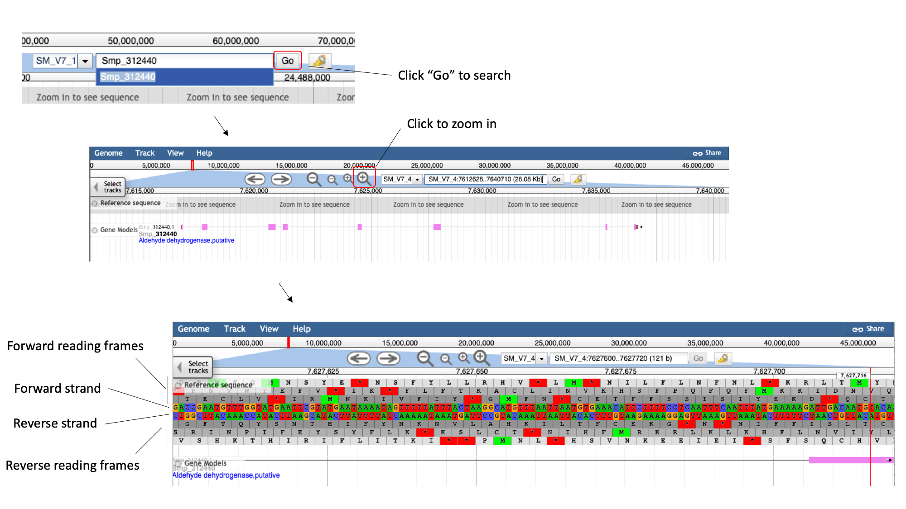
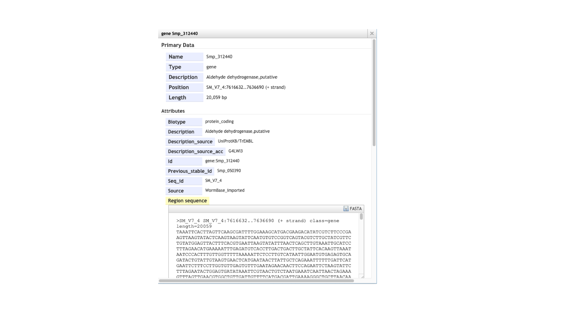
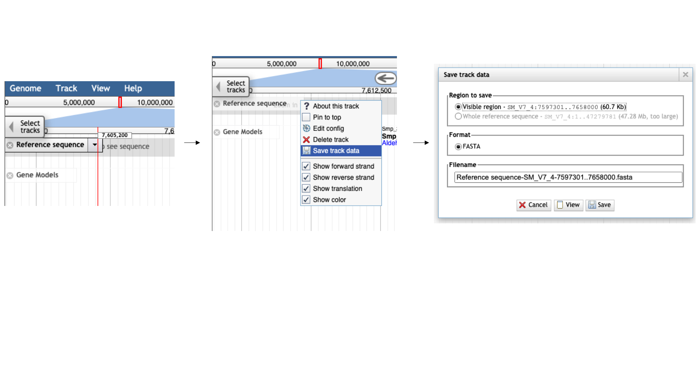
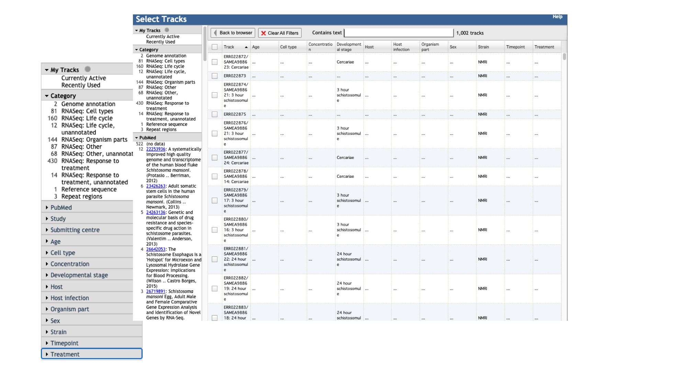
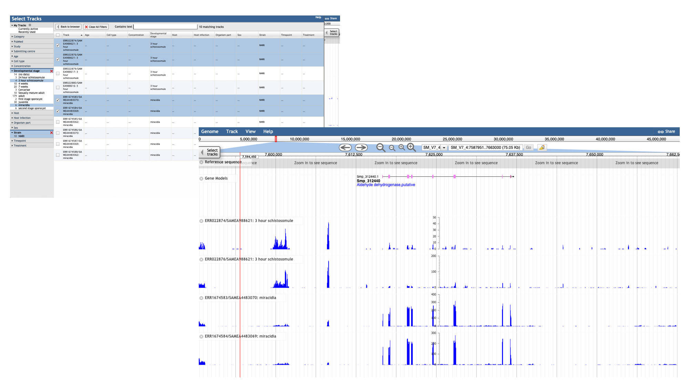
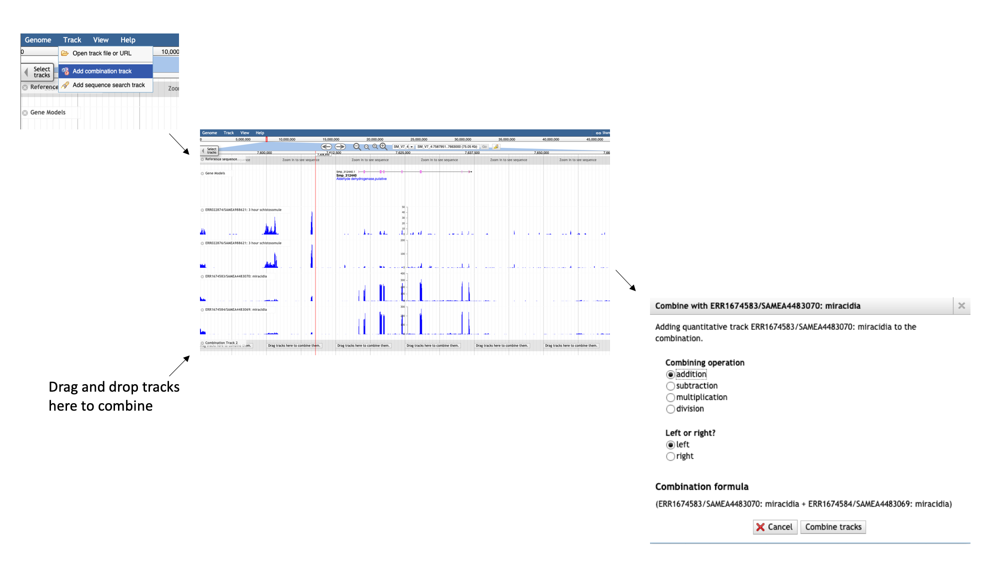
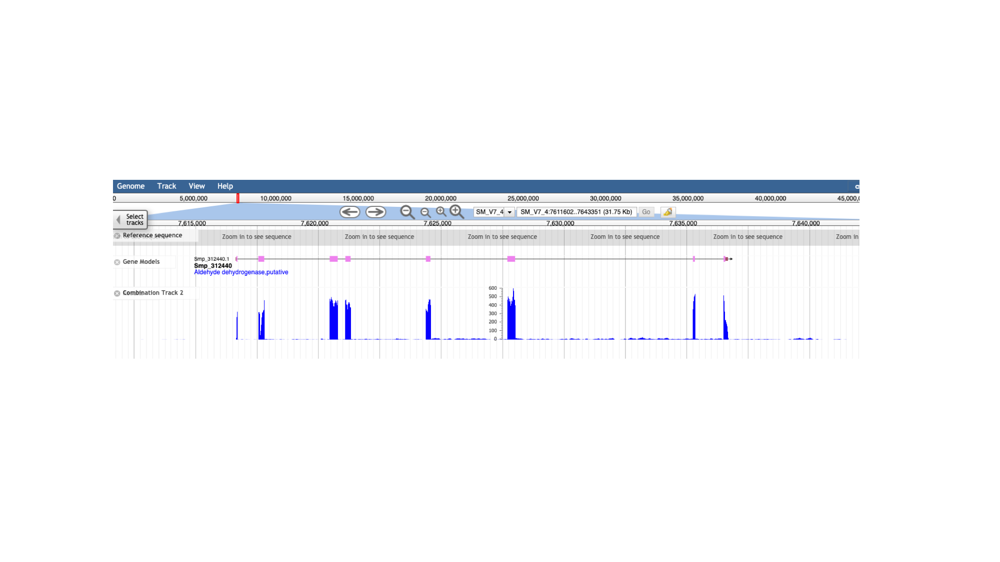
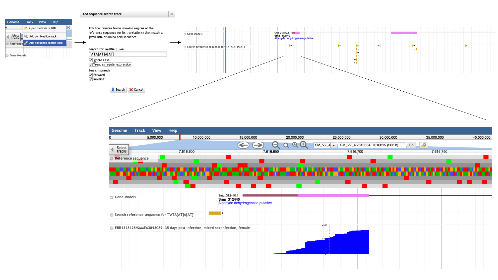

# WormBase ParaSite part 2

## Table of contents
1. [Tools](#tools)
    * [BLAST](#blast)
    * [The genome browser](#genome_browser)
    * [Expression data](#expression_data)
    * [VEP](#vep)
2. [Accessing WormBase ParaSite data programmatically](#programmatic_access)
    * [Working with sequence and annotation files](#files)
    * [The REST API](#api)

## Tools 

### BLAST 

### The genome browser 

A genome browser is a tool that allows you to visualise a genome assembly and its features, together with experimental data aligned to the genome. Genome browsers are useful in many respects. For example, they are used for visualising gene models in their genomic context, and also to assess the correctness of the model. They are also used for visualising functional genomics data, such as the results of ChIP-Seq and RNA-Seq experiments.

There are several commonly used genome browsers in bioinformatics, each with different features. Examples include:

* The Integrative Genomics Viewer (IGV) - this software can be downloaded and installed locally to work with local data without internet access.
* The UCSC Genome Browser - this browser hosts selected vertebrate species and some model organism (and closely related) species.
* Ensembl - this can be used to browse a large catalog of genomes across the tree of life. WormBase ParaSite has an instance of the Ensembl browser built in.
* Artemis/ Artemis Comparison Tool (ACT) - similar to IGV, this can also run locally without the internet. It can also be used to edit (i.e. change) gene models (to correct errors). ACT is a tool for visualising synteny (regions of similarity) between sequences.
* JBrowse - this is the genome browser that we’ll be using today. WormBase ParaSite has an instance of JBrowse for every genome that it hosts. The Apollo project is a well known extension of JBrowse, which, like Artemis, can be used to edit gene models.

#### Using JBrowse: basic functionality

In this example we’ll introduce the basic functionality of JBrowse, and demonstrate how to use the various tracks.

* Navigate to the S. mansoni genome page and select the “Genome Browser (JBrowse)” icon.

In the genome browser, each scaffold is represented from its 5-prime end to its 3-prime end (relative to the forward strand). You can navigate to different scaffolds using the drop down menu in the middle of the screen, or by typing coordinates into the text box. Different types of data aligned to the genome are represented as tracks. When you first open JBrowse, one track will be on by default: the reference gene set.

For this example, we’ll consider that you’re interested in the gene Smp_312440.

* Start by typing the identifier into the search box and clicking “Go” to navigate to the gene.
* Zoom in by clicking the large magnifying glass with a “+” symbol until the reference sequence resolves.

Here, you can see the forward and reverse DNA strands, together with the six possible translational reading frames (3 forward and 3 reverse).

* Zoom out again so that you have the whole gene model in your field of view.
* To extract sequence information about the gene, click the gene model such that a dialogue box pops up.

Scrolling down the content of the box, you can extract genomic or cDNA sequence, or the sequence of specific subfeatures (specific exons or UTRs, for example).

Alternatively, you may wish to extract the genomic sequence of a whole region:

* Click the arrow next to the “Reference sequence” track label in the top left of the screen, select “Save track data”, then download the sequence as a FASTA
file.

#### Tracks

We can also use JBrowse to view other types of data aligned to the genome. 

* Click the “select tracks” button in the top left of the screen.

For most species, in addition to the gene model (“Genome Annotation”) track, there are two additional main types of track:

1. Repeat regions tracks - repetitive regions of the genome are annotated as part of WormBase ParaSite’s production process.

2. RNASeq tracks - WormBase ParaSite has a process of finding and aligning RNASeq data in the sequencing archives for our species of interest. These can be useful, for example, for checking that a gene model is well supported by expression data, or seeing in which life stages, or under which conditions, a gene of interest is transcribed.

For species with a lot of publicly available data, such as S. mansoni, the easiest way to explore the samples that are available is by using the facets on the left hand side. When sequencing experiments are submitted to the archives, submitters are asked to provide metadata on the samples (that is, to describe the samples in a detailed and structured way). This data is used to classify the samples in JBrowse.

Let’s say you want to see in which life stages Smp_312440 is expressed.

* Click the “” facet and select ..
* Select a few of the available libraries and click “back to browser”.

Each track represents a different sequencing library, and shows the number of reads that have been aligned at each position. By mousing over the histogram, you can see the exact number of aligned reads at each base. We can see that a lot of the tracks show biological replicates of the same condition (single sex infections or mixed sex infections). We can use combination tracks to combine replicate tracks “on the fly”, so we use up less space on the screen.

* In the main menu at the top of the page, select “Track” and “Add combination track”.

A new empty track should appear. You can then drag and drop existing tracks in to combine them. When you add additional tracks, a dialogue box should appear for you to select the type of operation to use to combine them. For this example, we’ll choose “addition”: you’ll now see the total number of reads across both selected libraries that aligned at each region. Note that different set operations can be performed, including subtraction, multiplication and division; these might make sense depending on the tracks that are being combined and the information that you’re interested in.

As well as seeing that Smp_312440 is expressed in these conditions, we can use the coverage histograms to assess the quality of the gene model. Most parasitic worm genomes are annotated with automated pipelines. Whilst annotation algorithms can often be very accurate, they are not infallible. Most of the gene models that you look at in WormBase ParaSite will not have been checked by a human curator, so it is important not to take them as “truth” unless you verify that they agree with any evidence that is available.

In this case we can see that each of the exons in the gene model have got good RNASeq coverage, with no additional exons suggested by the RNASeq data.

#### Motif searching

It might be useful to have a quick, visual way of showing where certain motifs (short, defined DNA sequences) are found in the reference sequence. JBrowse offers a quick and flexible way to do this. We’ll demonstrate this by generating a track for the TATA box sequence (a sequence found in the promoter region of many eukaryotic genes). The consensus TATA sequence is TATA[A/T]A[A/T] (where [A/T] indicates that either A or T could be present at that position).

* In JBrowse, select “Track” from the main menu bar, followed by “Add sequence search track”.
* Type the motif that we’re searching for in the dialogue box, in this format: TATA[AT]A[AT], and tick “Treat as regular expression”. This means that the [AT] section of the motif will be interpreted as a regular expression (ie, the base in this position can be either A or T). We will limit our search to the forward strand, because that’s the strand that our gene of interest is on. Click “Search”.

Going back to the main JBrowse window, a new track has appeared with all instances of the motif marked. Zooming in to the 5-prime end of Smp_312440, we can see that one of these is well positioned to be our TATA box.

#### Visualising your own data

As well as looking at publicly available data, you can use WormBase ParaSite JBrowse to visualise your own data. We’ll demonstrate how to do this using a BAM file that we have provided for you. BAM is a type of sequence file, in this case of RNA sequencing data. BAM files are binary (i.e., compressed and not human readable) versions of SAM files. SAM files are tab-delimited text files; each line in a SAM file represents a sequencing read, and (optionally) a description of how that read is aligned to a reference sequence.

In the module 3 data directory you should find a file named somules_isoseq_sorted.bam. This is a binary file, so trying to read it as it is won’t be very informative. samtools is a useful software package for manipulating SAM and BAM files. We’ll use a samtools command to convert the BAM file to a SAM file so we can have a look at how it’s structured. Move to the module 3 data directory and type the following into your terminal:

    samtools view -h somules_isoseq_sorted.bam | less

The SAM file starts with a header section. All header lines begin with a ‘@’ character.

### Expression data 

### VEP 

## Accessing WormBase ParaSite data programmatically 

### Working with sequence and annotation files 

### The REST API 

