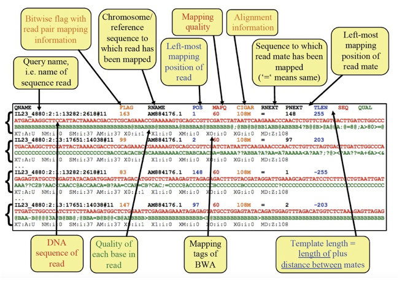
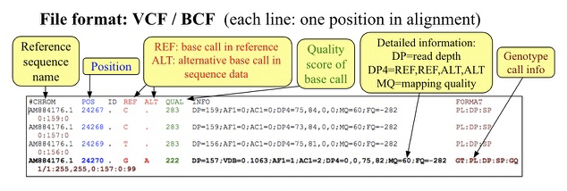
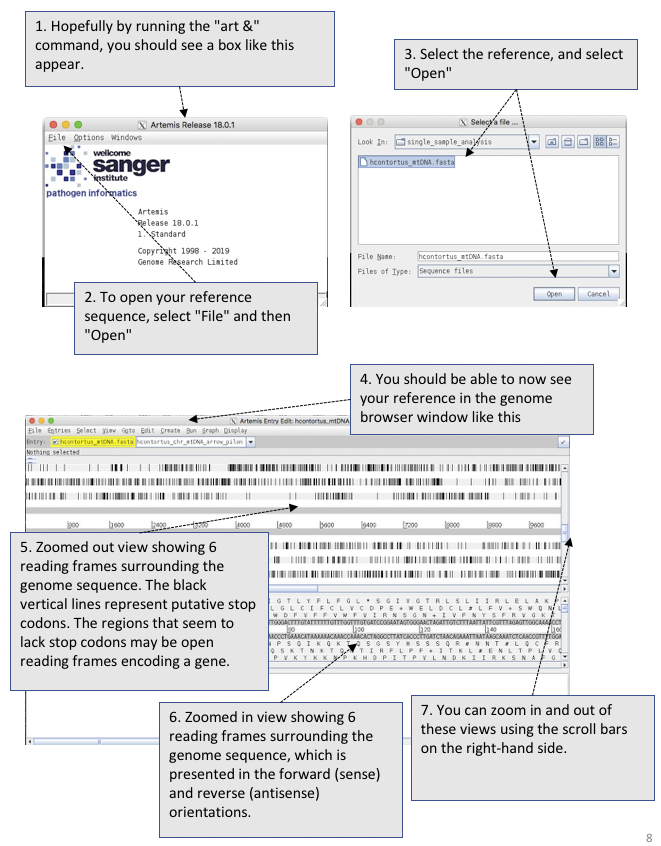
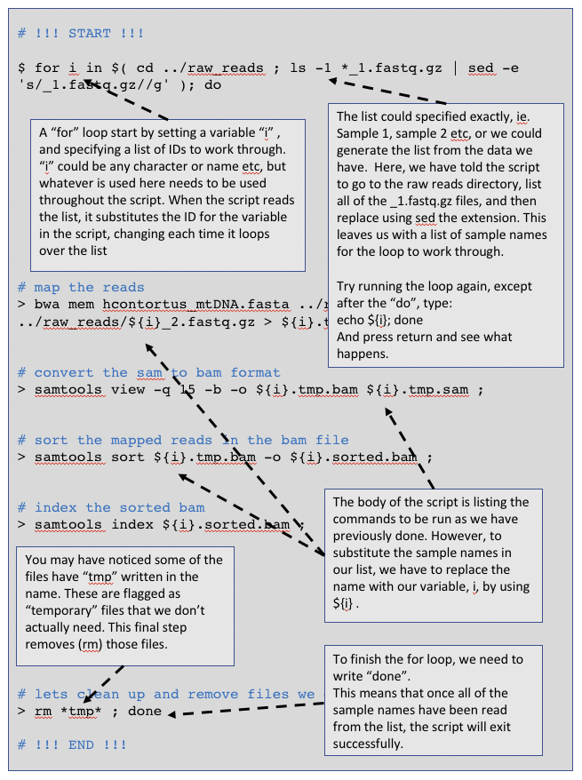
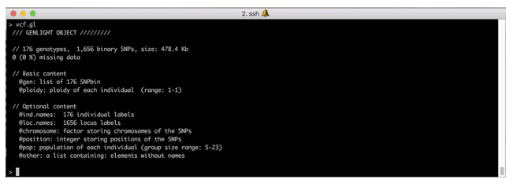
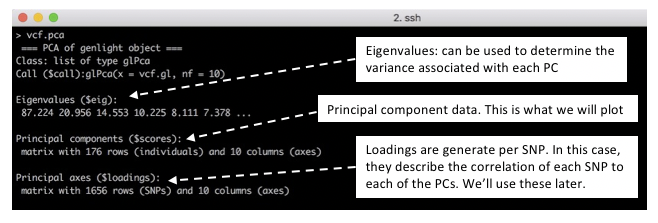
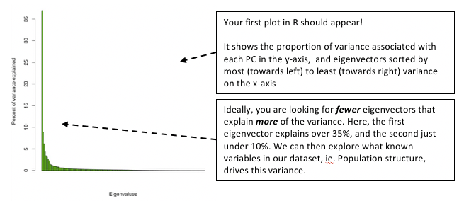
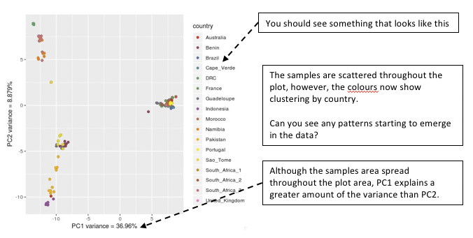
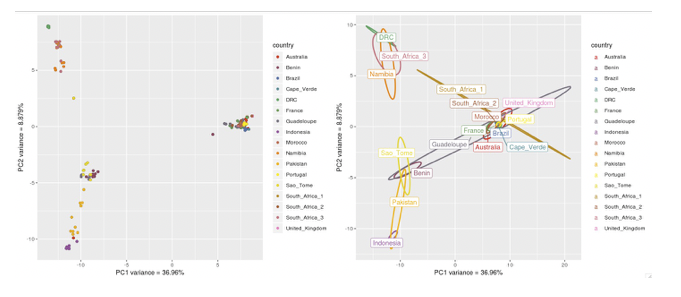

# Genetic Diversity


## Table of Contents
1. [Introduction and aims](#intro)
2. [Getting started on the command line - Basic unix](#getting_started)
3. [Files and directories](#files_directories)
4. [Looking inside files](#inside_files)
5. [Searching the content of files using grep](#grep)
6. [Processing columns with awk](#awk)
7. [Loops](#loops)
8. [Bash scripts](#scripts)
9. [UNIX quick reference guide](#quick_ref)

---


## Overview and Aims
The re-sequencing of a genome typically aims to capture information on Single Nucleotide Polymorphisms (SNPs), INsertions and DELetions (INDELs) 
and Copy Number Variants (CNVs) between representatives of the same species, usually in cases where a reference genome already exists (at least 
for a very closely related species). Whether one is dealing with different bacterial isolates, with different strains of single-celled parasites, 
or indeed with genomes of different human individuals, the principles are essentially the same. Instead of assembling the newly generated sequence 
reads *de novo* to produce a new genome sequence, it is easier and much faster to align or map the new sequence data to the reference genome (please 
note that we will use the terms “aligning” and “mapping” interchangeably). One can then readily identify SNPs, INDELs, and CNVs that distinguish 
closely related populations or individual organisms and may thus learn about genetic differences that may cause drug resistance or increased virulence 
in pathogens, or changed susceptibility to disease in humans. One important prerequisite for the mapping of sequence data to work is that the reference
and the re-sequenced subject have the same genome architecture.


In this exercise, you will be analyzing genetic variation in the gastrointestinal helminth *Haemonchus contortus*. *H. contortus* is an important 
pathogen of wild and domesticated ruminants worldwide, and has a major impact on the health and economic viability of sheep and goat farming in 
particular. It is also a genetically tractable model used for drug discovery, vaccine development, and anthelmintic resistance research. A chromosome-scale 
reference genome assembly and manually curated genome annotation are both available to download and explore at WormBase Parasite.
The sequencing data you will be using in this module is from two recently published studies - [Salle et al 2019 Nature Communications](https://doi.org/10.1038/s41467-019-12695-4)
and [Doyle et al. 2020 Communications Biology](https://doi.org/10.1038/s42003-020-01377-3) - which describe the global and genome-wide genetic diversity of *H. contortus*, all of which was generated at the Wellcome Sanger Institute. 
Analysis of global diversity allows you to understand aspects of the species biology, such as how different populations are connected (which may be important to understand the spread of a pathogen or ongoing transmission), whether populations are growing or declining (perhaps in response to drug treatment), or the impact of selection on regions or specific genes throughout the genome. Although whole genome sequencing data was generated for these samples, we have extracted only 
the mitochondrial DNA-derived reads for you to work with. The main reason for this is that at this scale, the data should be able to be analysed 
efficiently on your computer without the need for high performance computing infrastructure and/or capacity. 


We will be working in both the unix and R command line environments. This is because we typically manipulate high throughput sequencing data such 
as those you will be using in unix, i.e., read mapping and SNP calling, whereas the population genetic analyses are commonly written using R tools. 
Although some graphical user interface (GUI) tools such as CLC Genomics and Genious are available (at a cost) to do similar tasks, using the command 
line gives you much greater flexibility in the analyses that you can do and the scale that you can do it, and it is freely available. There will be 
a considerable amount of coding in this module - this may be daunting at first, however, with some practice, it will become much easier. 

We will also be using Artemis, a computer program designed to view and edit genomic sequences and visualise annotations in a highly interactive graphical 
format. In this exercise, we will use Artemis to visualise our genomic sequencing data mapped to our reference sequence, and identify the variants that 
differ between our samples and the reference.


Overall, the aims of this module are to familiarize you with tools and concepts that will allow you to:
- map high throughput sequencing reads to a genome;
- bioinformatically identify and filter single nucleotide polymorphisms in your samples;  
- visualize sequencing reads and genetic variants in your samples;
- analyze patterns of genetic diversity in your data, and link these patterns to metadata to uncover biological insights in your species.
---
[↥ **Back to top**](#top)


## Short read mapping
There are multiple short-read alignment programs each with its own strengths, weaknesses, and caveats. Wikipedia has a good list and description of 
each. Search for “Short-Read Sequence Alignment” if you are interested. We are going to use the Burrows-Wheeler Aligner or BWA. 

From the manual available here http://bio-bwa.sourceforge.net/ : “BWA is a software package for mapping low-divergent sequences against a large 
reference genome, such as the human genome. It consists of three algorithms: BWA-backtrack, BWA-SW and BWA-MEM. The first algorithm is designed 
for Illumina sequence reads up to 100bp, while the rest two for longer sequences ranged from 70bp to 1Mbp. BWA-MEM and BWA-SW share similar features 
such as long-read support and split alignment, but BWA-MEM, which is the latest, is generally recommended for high-quality queries as it is faster 
and more accurate. BWA-MEM also has better performance than BWA-backtrack for 70-100bp Illumina reads.”

Although BWA does not call Single Nucleotide Polymorphisms (SNPs) like some short-read alignment programs, e.g. MAQ, it is thought to be more 
accurate in what it does do and it outputs alignments in the SAM format which is supported by several generic SNP callers such as SAMtools and GATK.
BWA has a manual that has much more details on the commands we will use. This can be found here: http://bio-bwa.sourceforge.net/bwa.shtml or from 
the original reference here:

Li H. and Durbin R. (2009) Fast and accurate short read alignment with Burrows-Wheeler Transform. Bioinformatics, 25:1754-60. [PMID: 19451168]


Lets get started!
```bash 
# Lets move to the working directory
cd Module_6_Genetic_Variation

ls -ltr 

```
  
**Figure 1.**  

You should be able to see one directory called “raw_reads” containing all of the sequencing data we will be working with today, a directory 
called "R_analysis" where we will performed our population genetic analyses, and two files, one is your reference sequence that we will map 
our raw reads to, and the other contains metadata about our samples that we will be using later. It is a good idea to collect all metadata to 
do with a study early, as it can help you explore your data in the analysis, and help interpret the genetic signals that you hopefully will 
discover.

## Mapping reads from a single sample
To start with, we are going to work on a single sample to familiarize you with the necessary steps required to:
- get organized with directories (it is really important to keep organized!!!)
- prepare your reference sequence
- map your reads
- convert your mapped reads file into a format that can be read by out visualization tool, Artemis.

```bash
# make a new directory (mkdir) and move into it (cd)
mkdir single_sample_analysis

cd single_sample_analysis


# lets copy (cp) the reference into our working directory
cp ../hcontortus_mtDNA.fasta .


# prepare your reference sequence by creating an index. An index is like an index in a book - it speeds up searching 
bwa index hcontortus_mtDNA.fasta


# map your reads to the reference using bwa mem
bwa mem hcontortus_mtDNA.fasta ../raw_reads/AUS_WAL_OA_001_1.fastq.gz ../raw_reads/AUS_WAL_OA_001_2.fastq.gz > single_sample.tmp.sam


# convert the sam file to a bam file. We will also filter the reads using the “q” parameter
samtools view –q 15 –b –o single_sample.tmp.bam single_sample.tmp.sam


# sort the reads in the bam file 
samtools sort single_sample.tmp.bam –o single_sample.tmp.sorted.bam


# finally, index the bam file
samtools index single_sample.tmp.sorted.bam

# to make sense of what we are doing with the mapping, lets open the top of our SAM file and have a look at what the data means
head single_sample.tmp.sam


```
  
**Figure 2.** Exploring the SAM file format
---
[↥ **Back to top**](#top)


## Calling SNPs in our mapped sample
To identify variants in our mapped reads, we are going to use a tool called “bcftools" and its subcommands "mpileup” and “call”. There 
are many variant calling tools available, each with different strengths and sometimes weaknesses. Given we are working with mitochondrial 
DNA which is haploid, the approach here is quick and straight-forward. 

In the first command below, you will see we have joined two commands - mpileup and call - using a ”pipe” represented by “|”. This allows 
us to perform the mpileup and then send the output to call without generating any intermediate files. As you become more experienced 
using the command line, you will find “pipes” are very handy.

The mpileup step is assessing, at each position in the reference genome, the number of reads that support the reference base OR a variant 
base, and their quality. 
The call step is interpreting the mpileup data, identifying positions in the reference for which there is a variant (-v), and generates a 
consensus genotype (-c) based on a haploid genome (--ploidy 1). We have also indicated that we only want to look at SNPs, by excluding indels. 
The output of this is is variant call format or VCF file, which is a standard file format or representing genetic variation. The BCF is a 
binary version of the VCF.

SNP call data can take up a lot of disk space, and so we have generated a compressed format (gz). It is always good to remove unnecessary 
files, and/or compress large files.

```bash
# used bcftools mpileup and call commands to identify variants - NOTE: this command is all one line
bcftools mpileup -Ou -f hcontortus_mtDNA.fasta single_sample.tmp.sorted.bam | bcftools call -v -c --ploidy 1 -Ob --skip-variants indels > single_sample.tmp.bcf


# index the bcf variant file
$ bcftools index single_sample.tmp.bcf


# convert the bcf file to a vcf file
bcftools view single_sample.tmp.bcf –Oz > single_sample.tmp.vcf.gz
 

# index the vcf.gz file using tabix
tabix –p vcf single_sample.tmp.vcf.gz


# you can have a look at the vcf using the following
zcat single_sample.tmp.vcf.gz | less

```
  
**Figure 3.** Exploring the VCF file format


```bash
# lets see what we have generated with the previous commands
ls -lrt
```
  
**Figure 4.**

```
# to begin to explore what this data looks like, we will load Artemis and import the relevant data. In this case there relevant data we will load are:
- the reference sequence: hcontortus_mtDNA.fasta
- the mapping data: single_sample.tmp.sorted.bam
- the variant data: single_sample.tmp.vcf.gz

art &
```


## Artemis
We will use Artemis to visualize your mapped reads, and identify variant positions from the SNP calling we have performed on our single sample. 
Artemis has many features for exploring genomes, genome annotations, and genomic data (DNAseq, RNAseq, and more) that can be layered onto the 
genome. To explore the full functionality, you would need at least a week-long course, so we will just touch on the basics. However, feel free 
to explore Artemis in your own time, and do ask questions if you have any.   

  
**Figure 5.** Opening and viewing reference sequencing data in Artemis

  
**Figure 6.** Opening and viewing read and variant data in Artemis


Lets explore our data.
1. Try zoom in and zoom out using the scroll bar on the right hand side.
2. Try double clicking on a mapped read. Can you find the read and its mate? Hovering over a read with your mouse pointer may help.
	- We can visualise our paired reads easily by right clicking on the mapped 	reads, select "Views" and select "Paired Stack". 
3. Similarly, hovering over a SNP call will give you information about the SNP. What do the different colours mean?
4. We can visualise the SNP calls on the mapped reads. Right click on the mapped reads, select "Show" and check the "SNP marks" box. 
  Red lines show show on the mapped reads. What do you think the difference between the red lines that cover all reads at a single position, 
  compared to sporadic red lines that affect on a few reads?


---
[↥ **Back to top**](#top)

## Mapping reads from multiple samples
Now that we have shown you the steps involved in mapping a single sample, we will now show you how to map multiple samples. While you could 
repeat exactly the same commands as before and just change the sample name each time, this would be a lot of manual work, and would take a 
considerable amount of time to do it. We have enough samples that this is quite impractical. However, the power of bioinformatics and coding 
comes from writing scripts that automates this process for you. 

Here, we will  use a “for loop” to iterate over the 176 samples we have provided. 

```bash
# make a new directory to do this next step in. First, go back to the module home directory, and then do the following:
mkdir multi_sample_analysis
cd multi_sample_analysis

# lets copy your reference sequence into the new working dir and index it as before
cp ../hcontortus_mtDNA.fasta .
bwa index hcontortus_mtDNA.fasta


# using a single loop function, perform the mapping, sam-to-bam conversion, filtering, and indexing, for XXX samples
# this is one long command. The “#” commented lines are there to remind you what each step is doing in the script, but should not be 
written in the command. Also note that the ">" at the beginning of some of the lines represent a continuation of the command across multiple 
lines, and should not be written as part of your command (similar to the "$" at the start of the line). 

# !!! START !!!
for i in $( cd ../raw_reads ; ls -1 *_1.fastq.gz | sed -e 's/_1.fastq.gz//g' ); do

# map the reads
> bwa mem hcontortus_mtDNA.fasta ../raw_reads/${i}_1.fastq.gz ../raw_reads/${i}_2.fastq.gz > ${i}.tmp.sam ;

# convert the sam to bam format
> samtools view -q 15 -b -o ${i}.tmp.bam ${i}.tmp.sam ;

# sort the mapped reads in the bam file
> samtools sort ${i}.tmp.bam -o ${i}.sorted.bam ; 
 
# index the sorted bam
> samtools index ${i}.sorted.bam ;

# lets clean up and remove files we don’t need
> rm *tmp* ; done

# !!! END !!!
```
While we are waiting for our mapping to finish, lets break down what we just did. 

NOTE: you don’t need to write any of the commands, on this page. This is just to explain what is going on. 

  
**Figure 7.** Breaking down out "for loop"

---
[↥ **Back to top**](#top)

## Calling SNPs in multiple samples at the same time 
Here, we are going to perform multi-sample SNP calling. While we could technically perform a loop like in our mapping example, the mpileup 
command can take a “file of file names” as input, which we will make in the first step. IN this case, we will list (ls) all of the sorted.bam 
files, and write them to a new file called bam.fofn. 

In some cases, the SNP caller is actually more accurate when multiple samples are called at the same time, and so this way (as opposed to single 
sample calling in a loop) is preferred.

```bash
# First, we need to make a file-of-file-names – “bam.fofn” – that will contain the names of all of the bam files that we will call SNPs
ls -1 *.sorted.bam > bam.fofn


# call SNPs in the bam files using bam.fofn to generate a multi-sample bcf
bcftools mpileup –Ou --annotate FORMAT/DP --fasta-ref hcontortus_mtDNA.fasta --bam-list bam.fofn | bcftools call -v -c --ploidy 1 -Ob --skip-variants indels > all_samples.bcf


# index the multi-sample bcf
bcftools index all_samples.bcf


# convert the bcf to a compressed vcf
bcftools view all_samples.bcf -Oz > all_samples.vcf.gz


# index the compressed vcf
tabix -p vcf all_samples.vcf.gz


```

In general, SNP callers tend to call too many variants, and so some filtering is required. Depending on that the intended outcome of the 
analysis, i.e. Population genomics, or coding sequence analysis to identify causative mutations, the degree of filtering may differ.
Here, we will use vcftools to perform some basic filters, including on minor allele frequency (maf) that should be above 5% (which will 
exclude rare and perhaps uninformative variants, at least for this analysis, and by setting the minimum and maximum alleles to 2, we can 
collect biallelic SNPs, which are required for downstream analysis. Using the “recode” command, we will generate a new vcf containing only 
our SNPs that were kept after filtering.

```bash
# Filter SNPs in the vcf to select variants with:
# 1. a minor allele frequence (maf) greater than 0.05, and
# 2. minimum and maximum allele count of 2 

$ vcftools --gzvcf all_samples.vcf.gz --maf 0.05 --min-alleles 2 --max-alleles 2 --recode --out all_samples.filtered

```
Lets have a quick look in Artemis to see what our new data looks like. 

If you have closed the previous Artemis window down, follow the previous instructions to load Artemis and your reference sequence.

If you have kept the previous window open,  or have now reloaded Artemis, do the following
- select "File", "Read a BAM / CRAM / VCF" and open "all_samples.vcf.gz"
- On the SNP window, right click and check the box "Show Labels"

You should now be able to see all of the SNPs called for all of your samples. Just quickly, looking at the sample names, can you see 
any patterns in the SNPs based on similar names? Scrolling up and down in the SNP window will help. This is what we are trying to find. 

It is impractical to try an do any meaningful analysis by eye in Artemis, so we will move on to using informatic ways to find patterns 
and genetic relationships among our samples. 


---
[↥ **Back to top**](#top)

## Analysis of genetic variation using R
Well done getting this far! By now, you should  have been able to map reads from 176 samples, and call SNP variants in all of them. 
Now we want to explore these data and identify any patterns in the genetic variation that might tell us something about the biology of 
the parasite. To do so, we are going to use the language R. This is because there are a number of good population genetic tools, as well 
as plotting tools, written specifically in R that we will make use of. It is a little different from using the unix command line, but overall 
the same ideas apply. We will point out some of these differences as we go to try not to confuse you too much. We will be using Rstudio, which 
provides a convenient user interface that combines a scripting window, a command line window,  a plotting window, and a directory window. 

```bash
# In the unix shell, lets prepare your data
cd R_analysis
cp ../multi_sample_analysis/all_samples.filtered.recode.vcf .
cp ../sample_metadata.txt .

# Once you have completed this, open Rstudio. Note that there is a script that you use called "walk_through_genetic_diversity.R" to help you out.

```

```R
# Welcome to R!
# Some things look a little different in here… some of the commands are very similar between R and unix, but there are also some differences too.
 
> 

# R relies on packages or libraries that we need to load. They have previously been installed for you, but you will need to call on them each 
time to start R. Try load the following:

library(ggplot2)
library(dplyr)
library(session)

# There are many more packages required for this module to work, which are described in the appendix. Rather than getting you to type them 
all out, we will open an R environment that has them already loaded:

restore.session(file = 		"wtac_helminths.workbook.Rdata")

# We can save this environment for later by using the following:

save.session(file = "wtac_helminths.workbook.Rdata")

# this can be a good thing to do at the end of the day.

```

### Import and prepare your data for analysis
```R
# Lets specify your input files that we will load into R
#-- the vcf contain the SNP data your generated with bcftools
vcf_file  <-  "all_samples.filtered.recode.vcf"


#-- metadata that describes information about the samples, such as country of origin, and GPS coordinates
metadata_file <- "sample_metadata.txt"


# Read the actual data into R
vcf <- read.vcfR(vcf_file, verbose = FALSE)
metadata <- read.table(metadata_file, header = TRUE)


# Convert your data into a “data frame” that the analysis  packages we will use can interpret easily. We will use a “genlight” format, which is good for storing variant call data. We will add the country IDs for each sample to the dataset, and because we are working on haploid mitochondrial DNA, we will set the ploidy to 1
vcf.gl <- vcfR2genlight(vcf)
pop(vcf.gl) <- metadata$country
ploidy(vcf.gl) <- 1


# Lets have a look at how the data is formatted
vcf.gl

```

  
**Figure 8.** Viewing your variant data in genlight format in R


```R
# Have a close look at how the data is store in this object, for example

vcf.gl@ind.names
vcf.gl@pop

```

---
[↥ **Back to top**](#top)


## Principal component analysis of genetic diversity
```R
# Perform a PCA analysis, and we’ll have a look at it
vcf.pca <- glPca(vcf.gl, nf = 10)
vcf.pca
```
  
**Figure 9.** Understanding the data generated by PCA

```R
# We will extract the scores for each PC in preparation for making some figures, and add the country information to allow us to explore the data 
a little better
vcf.pca.scores <- as.data.frame(vcf.pca$scores)
vcf.pca.scores$country <- metadata$country 


# We will also determine the variance each PC contributes the data, which will help us understand potential drivers of patterns in our dataset. 
Lets plot the eigenvectors to try an understand this a bit more.

barplot(100*vcf.pca$eig/sum(vcf.pca$eig), col=“green”)
title(ylab = "Percent of variance explained") 
title(xlab = "Eigenvalues")

```
  
**Figure 10.** Loading plot from the PCA

```R
# Lets extract the variance associated with the top 4 PCs, so we can use them in our plots.
eig.total <- sum(vcf.pca$eig)
PC1.variance <- formatC(head(vcf.pca$eig)[1]/eig.total * 100)
PC2.variance <- formatC(head(vcf.pca$eig)[2]/eig.total * 100)
PC3.variance <- formatC(head(vcf.pca$eig)[3]/eig.total * 100)
PC4.variance <- formatC(head(vcf.pca$eig)[4]/eig.total * 100)


# Lets check that this has worked
PC1.variance 
[1] "36.96”
# This suggests that PC1 describes 36.96% of the variance in the data, which is consistent with our previous plot.


# OK, time to visualize our data and make some plots! 
# Lets build a plot of your data using ggplot, and explore how to incorporate additional information into the plot to make it more 
informative. Ggplot works by adding layers of information (hence the “+”) to build the plot.
plot12 <- ggplot(vcf.pca.scores, aes(PC1, PC2)) + geom_point()
plot12


# We’ll add some axis labels, and incorporate the variance information to describe the relative importance of the spread of the data
plot12 <- plot12 + labs(x = paste0("PC1 variance = 	",PC1.variance,"%"),y = paste0("PC2 variance = ", 	PC2.variance, "%"))
plot12


# We need some labels to describe the country of origin. We will also set some colours 
cols <- colorRampPalette(brewer.pal(8, "Set1"))(17)

plot12 <- plot12 + geom_point(aes(col = country)) + 	scale_colour_manual(values=cols) 
plot12


```
Now we are starting to get somewhere. Lets have a look and see what the data is telling us so far.

  
**Figure 11.** Viewing your PCA analysis


```R
# Lets quickly look at PC3/PC4, and compare to the first plot.
plot34 <- ggplot(vcf.pca.scores, aes(PC3, PC4)) + 
	geom_point(aes(col = country)) + 
	labs(x = paste0("PC3 variance = ",PC3.variance,"%"), y = paste0("PC4 variance = ", PC4.variance, "%")) + 
	scale_colour_manual(values=cols) 

plot12 + plot34

# Note: You may have to change the plot dimension size by dragging the window size to make it wider.

```
Question: How do these plots compare? What is the relative contribution of variance in the PC3/PC4 plot compared to the PC1/PC2 plot?

Some patterns are starting to emerge regarding the genetic  relatedness within and between countries. However, it may be difficult to see 
some of the subtle features of the diversity that may be important. Lets explore the data in a slightly different way. 

```R
# Calculate the mean value of the principal components for each country. We can use this to make some labels for our plots

means <- vcf.pca.scores %>% group_by(country) %>% summarize(meanPC1 = mean(PC1), meanPC2 = mean(PC2),meanPC3 = mean(PC3), meanPC4 = mean(PC4))

```


```R
# Lets make a slightly different plot that our first comparison of PC1 and PC2, 

plot12.2 <- ggplot(vcf.pca.scores, aes(PC1, PC2, col = 	country)) + 
  labs(x = paste0("PC1 variance = ",PC1.variance,"%"), y = paste0("PC2 variance = ", PC2.variance, "%")) + 
  scale_colour_manual(values=cols) +
	stat_ellipse(level = 0.95, size = 1) +
	geom_label_repel(data = means,
	aes(means$meanPC1, means$meanPC2, col=means$country, 	label = means$country))

plot12 + plot12.2

```
In our new plot, we have added an ellipse that describes how the individual samples per country are distributed in the plot. We have also 
added country labels, which are positioned on the plot using the mean PC values we calculated earlier. We expect that if all samples within a 
country are genetically similar, we should see a small ellipse. However, if samples a not genetically similar, we will see a large ellipse. 

  
**Figure 12.** Viewing your PCA analysis

Compare the two plots, and try to identify similarities and differences

Q: Looking at the ellipses specifically, can you see any countries that have a different distribution than the others, and describe this difference?


---
[↥ **Back to top**](#top)


## Exploring genetic data using phylogenetic trees
PCA is a great way to explore complex datasets, including genomics data, and can help to identify drivers (sometimes even technical biases) that 
are shaping genetic differences between samples. However, it is a data reduction approach, and sometimes interpreting PCAs can be cryptic. Moreover, 
it is not a direct measure of genetic differentiation. 

A more common approach to directly compare samples is to perform a pairwise analysis of genetic differences, and to visualise them using a phylogenetic
tree. This is the next step in our analysis, and we will compare these results to the PCAs. 

```R
# Generated pairwise distances between samples that we will plot in a tree format
> tree_data <- aboot(vcf.gl, tree = "upgma", distance = 	bitwise.dist, sample = 100, showtree = F, 
	cutoff = 50) 

#--- make and plot the tree 
tree_plot <- ggtree(tree_data) + 
	geom_tiplab(size = 2, color = cols[pop(vcf.gl)]) + 
  xlim(-0.1, 0.3) + 
	geom_nodelab(size = 2, nudge_x = -0.006, nudge_y = 1) + 
	theme_tree2(legend.position = 'centre')

tree_plot

```
  
**Figure 13.** Analysis of pairwise distance using a tree

---
[↥ **Back to top**](#top)

## Integrating genetic and geographic data: maps
Here, we will make a map of the sampling locations, and plot the allele frequency data on it. This or similar may be used to explore how populations
may be connected to each other. We will explore this by plotting SNPs that seem to have the most effectin driving the variance in the PCA plot.

Note that we will only be looking at one variant at a time, and the genetic signal that differentiate these populations is made up of many variants. 
However, it should give you an idea of what could be done integrating these data types.

First, lets calculate allele frequencies per country, and integrate this with the latitude and longitude coordinates to prepare to plot.

```R
# Calculate allele frequencies per country
myDiff_pops <- genetic_diff(vcf,pops = vcf.gl@pop)
AF_data <- myDiff_pops[,c(1:19)]
AF_data <- melt(AF_data)
colnames(AF_data) <- c("CHROM","POS","country","allele_frequency")
AF_data$country <- gsub("Hs_","", AF_data$country)


# extract the latitude and longitude for each country from the metadata file
coords <- data.frame(metadata$country, metadata$latitude, metadata$longitude)
coords <- unique(coords)
colnames(coords) <- c("country","latitude","longitude")


# join the allele frequency data and the latitude/longitude data together
AF_data_coords <- dplyr::left_join(AF_data, coords, by = "country")


# lets have a look at the new data.
head(AF_data_coords)

```
  
**Figure 14.** Integrating allele frequencing and geographic data

```R
# Lets make a map, and plot the sampling locations on it. 
par(fg = "black”)
map("world", col = "grey85", fill = TRUE, border = FALSE)
map.axes()
points(metadata$longitude, metadata$latitude, cex = 1.5, pch = 20, col = cols[pop(vcf.gl)])
legend( x = "left", legend = unique(pop(vcf.gl)), col = cols[unique(pop(vcf.gl))], lwd = "1", lty = 0, 	pch = 20, box.lwd = 0, cex = 1)


# your map should look a bit like the one below.

```
  
**Figure 15.** World map with sampling locations plotted


We need to decide on which SNP(s) we want to plot. One approach might be to identify the variants that seem to have the greatest influence 
on the PC1 and PC2 variance. We can identify these in the “loadings” data set that was generated when we ran the PCA.

```R
# we can find the loadings in the PCA of our SNP data
vcf.pca 

```
  
**Figure 16.** Extracting SNP loadings from the PCA


```R
# We will make a new data frame, containing the SNP names and the loadings for the first two PCs
snp_loadings <- data.frame(vcf.gl@loc.names,vcf.pca$loadings[,1:2])


# sort the SNP loadings by the Axis 1 using the following:
head(snp_loadings[order(snp_loadings$Axis1,decreasing=T),])

```
  
**Figure 17.** Extracting SNP loadings from the PCA

```R
# select a SNP of interest based on its position 
AF_SNP_coords <- AF_data_coords[AF_data_coords$POS == ”7859",]


# Remake your map, but this time, we’ll add a pie chart describing the population allele frequency per country. 
par(fg = “black”)

map("world", col = "grey85", fill = TRUE, border = FALSE)

map.axes()

points(metadata$longitude, metadata$latitude, cex = 1.5, pch = 20, col = cols[pop(vcf.gl)])

for (i in 1:nrow(AF_SNP_coords)){ 
	add.pie(z = c(AF_SNP_coords$allele_frequency[i], 
	1-AF_SNP_coords$allele_frequency[i]), 
	x = AF_SNP_coords$longitude[i]+10, 
	y = AF_SNP_coords$latitude[i], 
	radius = 5, col = c(alpha("orange", 0.5), 	alpha("blue", 0.5)), labels = "") 
	}

legend(title=“Country”, x = ”topleft", 
	legend = unique(pop(vcf.gl)), 
	col = cols[unique(pop(vcf.gl))], pch = 20, 
	box.lwd = 0, cex = 0.9)
  
legend(title=“Allele frequency”, x = ”bottomleft", 
	legend = c("reference","variant"), 
	col = c(alpha("blue", 0.5), alpha("orange", 0.5)), 	pch = 15, box.lwd = 0, cex = 0.9)

```
You should now have a map containing both sampling locations and pie charts showing the variant allele frequency of the SNP at position 7859. 
If you have time, try explore plotting the allele frequency of other SNPs in PC1 or PC2.

  
**Figure 18.** World map with SNP frequency per sampling location

---
[↥ **Back to top**](#top)

## Summary
In this module, we have shown you how to:
- map and call variants from Illumina sequencing data in a single sample and a cohort of samples
- visualize this data in the genome browser Artemis
- Perform some basic data exploration and population genetics using R to understand the genetic relatedness within and between samples


---
[↥ **Back to top**](#top)


******
## License
<a rel="license" href="http://creativecommons.org/licenses/by/4.0/"></a><br />This work is licensed under a <a rel="license" href="http://creativecommons.org/licenses/by/4.0/">Creative Commons Attribution 4.0 International License</a>.

